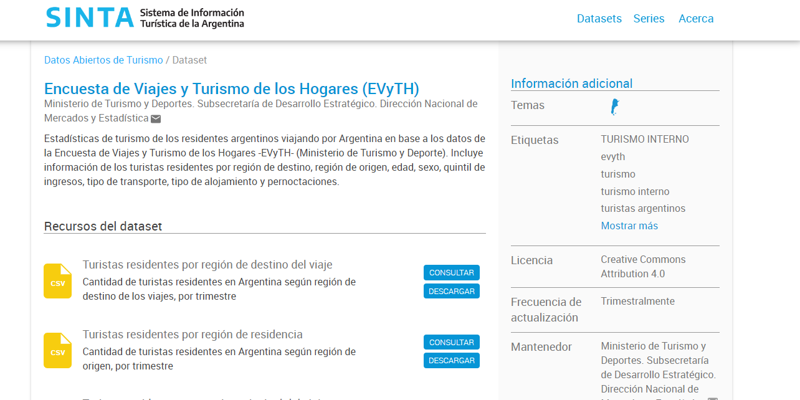
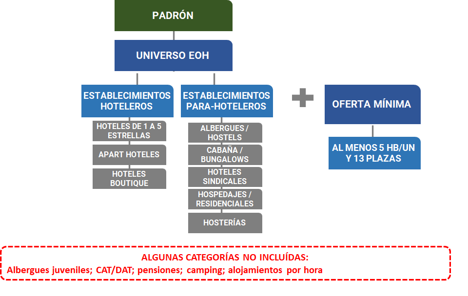

<script src="https://kit.fontawesome.com/cf918b5c60.js" crossorigin="anonymous"></script> 


```{r setup, include=FALSE}
options(htmltools.dir.version = FALSE)
library(fontawesome)
library(rvest)
library(httr)
# library(emo)
```

```{r xaringan-themer, include=FALSE, warning=FALSE}
library(xaringanthemer)
style_solarized_dark()
    
```

```{r include=FALSE}
knitr::opts_chunk$set(echo = F, message = F, warning = F, 
                      fig.align = 'left')
options(scipen = 9999)
```

```{r}

library(readxl)
library(tidyverse)
library(magrittr)
library(writexl)
library(dplyr)
library(haven)
library(lubridate)
library(glue)
library(janitor)

```


---

class: inverse, center, middle

# Encuesta de Viajes y Turismo en los Hogares (EVyTH)

---

class: justify, middle


## *Consideraciones generales del relevamiento* ##


- **Objetivo**: Medir y caracterizar la evolución de los viajes turísticos y los gastos asociados que las personas residentes en Argentina realizan tanto dentro del país (turismo interno) como al exterior (turismo emisivo). En conjunto, los viajes turísticos relevados dan cuenta del turismo nacional.


- **Temporalidad**: Encuesta de carácter mensual (Año 2006, 1er. Trim 2011 y  año 2012 de forma continua).


- **Representatividad geográfica**: Grandes Aglomerados Urbanos (más de 100 mil habitantes), el 62% de la población del país.


- **Método de recolección**: Encuestas telefónicas (CATI),

---

class: justify, top


## *Cobertura temática* ##


**Caracterización del viaje**:

- Estadía del viaje
- Origen
- Destino principal del viaje
- Motivo de viaje
- Transporte
- Alojamiento
- Actividades realizadas
- Organización del viaje
- Calificación de diferentes aspectos
- Gasto

---

class: justify, top

## *Cobertura temática* 


**Caracterización de los visitantes**: 

- Sexo
- Edad
- Quintil de ingreso
- Tamaño del grupo familiar
- Educación
- Características ocupacionales

---

class: inverse, center, middle

# ¿Qué información se genera a partir del relevamiento?

---

## *Información disponible en el sitio web de SINTA* 

https://www.yvera.tur.ar/sinta/

.pull-left[


]
.pull-right[



]

---


.left[EVYTH]


```{r}


turistas_dest_total <- read.csv("entradas/evyth/tur_int_turistas_residentes_destino_serie.csv") %>% 
  mutate(anio=year(indice_tiempo))

graf_1 <- turistas_dest_total %>%
  group_by(indice_tiempo) %>%
  summarise(turistas=sum(turistas)) %>% 
  ungroup() %>% 
  mutate(indice_tiempo=as.Date(indice_tiempo)) %>% 
  mutate(turistas=turistas/1000)

```


```{r fig.height = 8, fig.width=15}

#Turistas por trim:


ggplot(data = graf_1,aes(x=indice_tiempo,y=turistas))+
  geom_line(linewidth=2,color="red", alpha = 0.4)+
  geom_point(size=3,color="red", alpha = 0.9)+
  geom_hline(yintercept = 0, color = "grey", alpha =0.7, size = 0.5)+
  labs(title = "Turistas residentes según trimestre",
       x = "",
       y = "Turistas (en miles)",
       colour="",
       caption = "Fuente: EVyTH") +
  theme(text = element_text(size = 12),
        plot.caption  = element_text(hjust = 0),
        plot.subtitle=element_text(colour = "grey"),
        plot.title=element_text(hjust = 0,face = "bold"),
        legend.title = element_blank(),
        legend.position = "bottom",
        panel.grid.major.y =  element_line (colour = "grey",
                                            size = 0.1,
                                            linewidth = 1),
        panel.grid.major.x =  element_line (colour = "grey",
                                            size = 0.1,
                                            linewidth  = 1),
        panel.background = element_blank(),
        axis.text.x = element_text(angle = 90))


```

---
.left[EVYTH]

```{r fig.align='center'}


graf_2 <- turistas_dest_total %>%
  #filter(anio==2019) %>%
  group_by(anio,region_destino) %>% 
  summarise(turistas=sum(turistas)) %>% 
  mutate(dist=prop.table(turistas)) %>% 
  mutate(dist=round(dist*100,1)) %>% 
  ungroup() %>% 
  select(anio,region_destino,dist) %>% 
  mutate(anio=as.character(anio))


```


```{r fig.height = 8, fig.width=12, fig.align='center'}

# Distribución de turistas por destino según año

ggplot(data = graf_2,aes(x=anio,y=dist,fill=region_destino,label=glue("{dist} %")))+
  geom_col()+
  geom_text(position = position_stack(vjust = .5))+
  scale_y_continuous(labels = function(x) paste0(x,"%"))+
  labs(title = "Distribución de los turistas segun región de destino",
       subtitle = "GAU, 2012-2022.",
       x = "",
       y = "",
       colour="",
       caption = "Fuente: EVyTH") +
  theme(text = element_text(size = 12),
        plot.caption  = element_text(hjust = 0),
        plot.subtitle=element_text(colour = "grey29"),
        plot.title=element_text(hjust = 0,face = "bold"),
        legend.title = element_blank(),
        legend.position = "top",
        panel.background = element_blank(),
        panel.grid.major = element_blank(),
        panel.grid.minor = element_blank())

rm(graf_1,graf_2,turistas_dest_total)


```

---

.left[EVYTH]


```{r}

#Turistas por origen:

turistas_orig_total <- read.csv("entradas/evyth/tur_int_turistas_residentes_origen_serie.csv") %>% 
  mutate(anio=year(indice_tiempo))

graf_3 <- turistas_orig_total %>%
  #filter(anio==2019) %>%
  group_by(anio,region_origen) %>% 
  summarise(turistas=sum(turistas)) %>% 
  mutate(dist=prop.table(turistas)) %>% 
  mutate(dist=round(dist*100,1)) %>% 
  ungroup() %>% 
  select(anio,region_origen,dist) %>% 
  mutate(anio=as.character(anio))


```


```{r fig.height = 8, fig.width=12, fig.align='center'}

# Distribución de turistas por destino según año

ggplot(data = graf_3,aes(x=anio,y=dist,fill=region_origen,label=glue("{dist} %")))+
  geom_col()+
  geom_text(position = position_stack(vjust = .5))+
  scale_y_continuous(labels = function(x) paste0(x,"%"))+
  labs(title = "Distribución de los turistas segun región de origen",
       subtitle = "GAU, 2012-2022.",
       x = "",
       y = "",
       colour="",
       caption = "Fuente: EVyTH") +
  theme(text = element_text(size = 12),
        plot.caption  = element_text(hjust = 0),
        plot.subtitle=element_text(colour = "grey29"),
        plot.title=element_text(hjust = 0,face = "bold"),
        legend.title = element_blank(),
        legend.position = "top",
        panel.background = element_blank(),
        panel.grid.major = element_blank(),
        panel.grid.minor = element_blank())

rm(graf_3,turistas_orig_total)


```


---

.left[EVYTH]


```{r}

#Turistas por origen:

#Edad

turistas_edad_total <- read.csv("entradas/evyth/tur_int_turistas_residentes_edad_serie.csv") %>% 
  mutate(anio=year(indice_tiempo))

graf_4 <- turistas_edad_total %>%
  #filter(anio==2019) %>%
  group_by(anio,edad) %>% 
  summarise(turistas=sum(turistas)) %>% 
  mutate(dist=prop.table(turistas)) %>% 
  mutate(dist=round(dist*100,1)) %>% 
  ungroup() %>% 
  select(anio,edad,dist) %>% 
  mutate(anio=as.character(anio))


```


```{r fig.height = 8, fig.width=12, fig.align='center'}

#Gráfico

ggplot(data = graf_4 %>% 
         mutate(edad=factor(edad,levels=c("Menos de 14 años",
                                            "14 a 29 años",
                                            "30 a 44 años",
                                            "45 a 59 años",
                                            "60 años o más",
                                            "Ns./ Nr."))),aes(x=anio,y=dist,fill=edad,label=glue("{dist} %")))+
  geom_col()+
  geom_text(position = position_stack(vjust = .5))+
  scale_y_continuous(labels = function(x) paste0(x,"%"))+
  labs(title = "Distribución de los turistas segun edad.",
       subtitle = "GAU, 2012-2022.",
       x = "",
       y = "",
       colour="",
       caption = "Fuente: EVyTH") +
  theme(text = element_text(size = 12),
        plot.caption  = element_text(hjust = 0),
        plot.subtitle=element_text(colour = "grey29"),
        plot.title=element_text(hjust = 0,face = "bold"),
        legend.title = element_blank(),
        legend.position = "top",
        panel.background = element_blank(),
        panel.grid.major = element_blank(),
        panel.grid.minor = element_blank())

rm(graf_4,turistas_edad_total)


```


---

.left[EVYTH]


```{r}

#Sexo

turistas_sexo <- read.csv("entradas/evyth/tur_int_turistas_residentes_sexo_serie.csv") %>% 
  mutate(anio=year(indice_tiempo))

graf_5 <- turistas_sexo %>%
  #filter(anio==2019) %>%
  group_by(anio,sexo) %>% 
  summarise(turistas=sum(turistas)) %>% 
  mutate(dist=prop.table(turistas)) %>% 
  mutate(dist=round(dist*100,1)) %>% 
  ungroup() %>% 
  select(anio,sexo,dist) %>% 
  mutate(anio=as.character(anio))


```


```{r fig.height = 8, fig.width=12, fig.align='center'}

#Gráfico

ggplot(data = graf_5 ,aes(x=anio,y=dist,fill=sexo,label=glue("{dist} %")))+
  geom_col()+
  geom_text(position = position_stack(vjust = .5))+
  scale_y_continuous(labels = function(x) paste0(x,"%"))+
  labs(title = "Distribución de los turistas segun sexo.",
       subtitle = "GAU, 2012-2022.",
       x = "",
       y = "",
       colour="",
       caption = "Fuente: EVyTH") +
  theme(text = element_text(size = 12),
        plot.caption  = element_text(hjust = 0),
        plot.subtitle=element_text(colour = "grey29"),
        plot.title=element_text(hjust = 0,face = "bold"),
        legend.title = element_blank(),
        legend.position = "top",
        panel.background = element_blank(),
        panel.grid.major = element_blank(),
        panel.grid.minor = element_blank())

rm(graf_5,turistas_sexo)


```


---

.left[EVYTH]


```{r}

#Quintil

turistas_quintil <- read.csv("entradas/evyth/tur_int_turistas_residentes_quintil_serie.csv") %>% 
  mutate(anio=year(indice_tiempo))

graf_6 <- turistas_quintil %>%
  #filter(anio==2019) %>%
  group_by(anio,quintil) %>% 
  summarise(turistas=sum(turistas)) %>% 
  mutate(dist=prop.table(turistas)) %>% 
  mutate(dist=round(dist*100,1)) %>% 
  ungroup() %>% 
  select(anio,quintil,dist) %>% 
  mutate(anio=as.character(anio))


```


```{r fig.height = 8, fig.width=12, fig.align='center'}

#Gráfico

ggplot(data = graf_6 %>% mutate(quintil=factor(quintil,levels = c("Quintiles 1 y 2",
                                                                  "Quintiles 3 y 4",
                                                                  "Quintil 5"))) ,aes(x=anio,y=dist,fill=quintil,label=glue("{dist} %")))+
  geom_col()+
  geom_text(position = position_stack(vjust = .5))+
  scale_y_continuous(labels = function(x) paste0(x,"%"))+
  labs(title = "Distribución de los turistas segun quintil de ingresos.",
       subtitle = "GAU, 2012-2022.",
       x = "",
       y = "",
       colour="",
       caption = "Fuente: EVyTH") +
  theme(text = element_text(size = 12),
        plot.caption  = element_text(hjust = 0),
        plot.subtitle=element_text(colour = "grey29"),
        plot.title=element_text(hjust = 0,face = "bold"),
        legend.title = element_blank(),
        legend.position = "top",
        panel.background = element_blank(),
        panel.grid.major = element_blank(),
        panel.grid.minor = element_blank())

rm(graf_6,turistas_quintil)


```


---

.left[EVYTH]


```{r}

#Motivo

turistas_motivo <- read.csv("entradas/evyth/tur_int_turistas_residentes_motivo_serie.csv") %>% 
  mutate(anio=year(indice_tiempo))

graf_7 <- turistas_motivo %>%
  #filter(anio==2019) %>%
  group_by(anio,motivo) %>% 
  summarise(turistas=sum(turistas)) %>% 
  mutate(dist=prop.table(turistas)) %>% 
  mutate(dist=round(dist*100,1)) %>% 
  ungroup() %>% 
  select(anio,motivo,dist) %>% 
  mutate(anio=as.character(anio))


```


```{r fig.height = 8, fig.width=12, fig.align='center'}

#Gráfico

ggplot(data = graf_7,aes(x=anio,y=dist,fill=motivo,label=glue("{dist} %")))+
  geom_col()+
  geom_text(position = position_stack(vjust = .5))+
  scale_y_continuous(labels = function(x) paste0(x,"%"))+
  labs(title = "Distribución de los turistas segun quintil de ingresos.",
       subtitle = "GAU, 2012-2022.",
       x = "",
       y = "",
       colour="",
       caption = "Fuente: EVyTH") +
  theme(text = element_text(size = 12),
        plot.caption  = element_text(hjust = 0),
        plot.subtitle=element_text(colour = "grey29"),
        plot.title=element_text(hjust = 0,face = "bold"),
        legend.title = element_blank(),
        legend.position = "top",
        panel.background = element_blank(),
        panel.grid.major = element_blank(),
        panel.grid.minor = element_blank())

rm(graf_7,turistas_motivo)


```


---

.left[EVYTH]


```{r}

#Alojamiento

turistas_alojamiento <- read.csv("entradas/evyth/tur_int_turistas_residentes_tipo_alojamiento_serie.csv") %>% 
  mutate(anio=year(indice_tiempo))

graf_8 <- turistas_alojamiento %>%
  #filter(anio==2019) %>%
  group_by(anio,tipo_alojamiento) %>% 
  summarise(turistas=sum(turistas)) %>% 
  mutate(dist=prop.table(turistas)) %>% 
  mutate(dist=round(dist*100,1)) %>% 
  ungroup() %>% 
  select(anio,tipo_alojamiento,dist) %>% 
  mutate(anio=as.character(anio))


```


```{r fig.height = 8, fig.width=12, fig.align='center'}

#Gráfico (cambiar colores)

ggplot(data = graf_8,aes(x=anio,y=dist,fill=tipo_alojamiento,label=glue("{dist} %")))+
  geom_col()+
  geom_text(position = position_stack(vjust = .5))+
  scale_y_continuous(labels = function(x) paste0(x,"%"))+
  labs(title = "Distribución de los turistas segun tipo de alojamiento.",
       subtitle = "GAU, 2012-2022.",
       x = "",
       y = "",
       colour="",
       caption = "Fuente: EVyTH") +
  theme(text = element_text(size = 12),
        plot.caption  = element_text(hjust = 0),
        plot.subtitle=element_text(colour = "grey29"),
        plot.title=element_text(hjust = 0,face = "bold"),
        legend.title = element_blank(),
        legend.position = "top",
        panel.background = element_blank(),
        panel.grid.major = element_blank(),
        panel.grid.minor = element_blank())

rm(graf_8,turistas_alojamiento)


```


---

.left[EVYTH]


```{r}

#Transporte

turistas_transporte <- read.csv("entradas/evyth/tur_int_turistas_residentes_tipo_transporte_serie.csv") %>% 
  mutate(anio=year(indice_tiempo))

graf_9 <- turistas_transporte %>%
  #filter(anio==2019) %>%
  group_by(anio,tipo_transporte) %>% 
  summarise(turistas=sum(turistas)) %>% 
  mutate(dist=prop.table(turistas)) %>% 
  mutate(dist=round(dist*100,1)) %>% 
  ungroup() %>% 
  select(anio,tipo_transporte,dist) %>% 
  mutate(anio=as.character(anio))


```


```{r fig.height = 8, fig.width=12, fig.align='center'}

#Gráfico

ggplot(data = graf_9,aes(x=anio,y=dist,fill=tipo_transporte,label=glue("{dist} %")))+
  geom_col()+
  geom_text(position = position_stack(vjust = .5))+
  scale_y_continuous(labels = function(x) paste0(x,"%"))+
  labs(title = "Distribución de los turistas segun tipo de transporte utilizado.",
       subtitle = "GAU, 2012-2022.",
       x = "",
       y = "",
       colour="",
       caption = "Fuente: EVyTH") +
  theme(text = element_text(size = 12),
        plot.caption  = element_text(hjust = 0),
        plot.subtitle=element_text(colour = "grey29"),
        plot.title=element_text(hjust = 0,face = "bold"),
        legend.title = element_blank(),
        legend.position = "top",
        panel.background = element_blank(),
        panel.grid.major = element_blank(),
        panel.grid.minor = element_blank())

rm(graf_9,turistas_transporte)


```


---

.left[EVYTH]


```{r}
#Estadía promedio

em <- read.csv("entradas/evyth/tur_int_turistas_residentes_estadia_media_anual_destino_serie.csv") %>% 
  mutate(anio=as.character(indice_tiempo)) %>% 
  mutate(region_destino=case_when(region_destino=="PBA - Partidos del GBA"~"Part.GBA",
                                  region_destino=="Patagonia"~"Pgonia",
                                  region_destino=="Córdoba"~"Cord.",
                                  TRUE~region_destino))


```


```{r fig.height = 8, fig.width=12, fig.align='center'}

#Gráfico:

ggplot(data = em,aes(x=anio, y=estadia_promedio_anual,
                     color=region_destino,label=region_destino))+ 
  geom_text()+
  labs(title = "Estadía promedio según región de destino.",
       subtitle = "GAU, 2012-2022.",
       x = "",
       y = "",
       colour="",
       caption = "Fuente: EVyTH") +
  theme(text = element_text(size = 12),
        plot.caption  = element_text(hjust = 0),
        plot.subtitle=element_text(colour = "grey29"),
        plot.title=element_text(hjust = 0,face = "bold"),
        legend.title = element_blank(),
        legend.position = "")


```


---

.left[EVYTH]


```{r}
#GPD

gpd <- read.csv("entradas/evyth/tur_int_turistas_residentes_gasto_promedio_anual_destino_serie.csv") %>% 
  mutate(anio=as.character(indice_tiempo)) %>%
  filter(anio %in%c("2017","2018","2019")) %>% 
  mutate(region_destino=case_when(region_destino=="PBA - Partidos del GBA"~"Part.GBA",
                                  region_destino=="Patagonia"~"Pgonia",
                                  region_destino=="Córdoba"~"Cord.",
                                  TRUE~region_destino))


```


```{r fig.height = 8, fig.width=12, fig.align='center'}

#Gráfico

ggplot(data = gpd,aes(x=anio, y=gasto_promedio_anual,
                     color=region_destino,label=region_destino))+ 
  geom_text()+
  labs(title = "Estadía promedio según región de destino.",
       subtitle = "GAU, 2012-2022.",
       x = "",
       y = "",
       colour="",
       caption = "Fuente: EVyTH") +
  theme(text = element_text(size = 12),
        plot.caption  = element_text(hjust = 0),
        plot.subtitle=element_text(colour = "grey29"),
        plot.title=element_text(hjust = 0,face = "bold"),
        legend.title = element_blank(),
        legend.position = "")

rm(gpd)


```


---

class: inverse, center, middle

# Encuesta de Ocupación Hotelera (EOH)

---

class: justify, middle


## *Consideraciones generales del relevamiento* ##

- **Objetivo**: Medir el impacto del turismo internacional e interno sobre la actividad de los establecimientos hoteleros y para-hoteleros del país (relevando información relacionada tanto con la OFERTA como con la DEMANDA)


- **Periodicidad**: Mensual, desde 2004.


- **Temporalidad**: Encuesta de carácter mensual (Año 2006, 1er. Trim 2011 y  año 2012 de forma continua).


- **Representatividad geográfica**: Se relevan 49 localidades, cuyos resultados se expanden a la totalidad de las regiones MINTURDEP


- **Método de recolección**: Cuestionario Auto-administrado.


- **Método de recolección**: 50 días posteriores al período relevado.

---

.left[#CATEGORÍAS RELEVADAS]


```{r out.width = "900px", out.height="500px",fig.align='center'}

```

---

class: justify, middle


## *Localidades relevadas*

Poner Mapa acá

---

## *Cobertura temática*


- Cantidad de HABITACIONES, UNIDADES Y PLAZAS disponibles por mes
- Cantidad de HABITACIONES, UNIDADES Y PLAZAS ocupadas por mes
- Cantidad de HABITACIONES, UNIDADES Y PLAZAS ocupadas en fines de semana (vie-sab)
- Viajeros y pernoctes registrados según origen
- Cantidad de días de apertura
- Personal ocupado
- Tarifa promedio
- Estructura por rubro de ingresos


---

class: inverse, center, middle

# ANÁLISIS DE LA INFORMACIÓN DISPONIBLE

---

.left[EOH: análisis de la información disponible]


```{r fig.height = 8, fig.width=12, fig.align='center'}

#Gráfico


eoh <- read.csv("entradas/eoh/Viajeros-hospedados-residentes-y-no-residentes.csv") %>% 
  mutate(anio = str_sub(indice_tiempo,1,4),
         mes = str_sub(indice_tiempo,6,7),
         anio_mes =glue("{anio}-{mes}-01"),
         anio_mes=as.Date(anio_mes)) %>% 
  select(-observaciones)


ggplot(data = eoh %>%
         filter(anio %in% c("2019","2020","2021","2022")) %>% 
         mutate(viajeros=viajeros/1000),aes(x=anio_mes,y=viajeros,color=origen_viajeros))+
  geom_line(size=2.5, alpha = 0.5)+
  geom_point(size=5, alpha = 0.5)+
  geom_hline(yintercept = 0, color = "grey", alpha =0.7, size = 0.5)+
  labs(title = "Viajeros hospedados según residencia",
       subtitle = "Total país, 2019-2022.",
       x = "",
       y = "Turistas (en miles)",
       colour="",
       caption = "Fuente: EOH") +
  theme(text = element_text(size = 14),
        plot.caption  = element_text(hjust = 0),
        plot.subtitle=element_text(colour = "grey29"),
        plot.title=element_text(hjust = 0,face = "bold"),
        legend.title = element_blank(),
        legend.position = "bottom",
        panel.grid.major.y =  element_line (colour = "grey",
                                            size = 0.1,
                                            linewidth = 1),
        panel.grid.major.x =  element_line (colour = "grey",
                                            size = 0.1,
                                            linewidth  = 1),
        panel.background = element_blank(),
        axis.text.x = element_text(angle = 90))+
  scale_x_date(date_breaks = "1 months",
               date_labels = "%b-%y")+
  scale_y_continuous(n.breaks=10)

rm(eoh)


```

---

.left[EOH: análisis de la información disponible]


```{r fig.height = 8, fig.width=12, fig.align='center'}

#Gráfico


eoh <- read.csv("entradas/eoh/Viajeros-hospedados-residentes-y-no-residentes-por-destino.csv") %>% 
  mutate(anio = str_sub(indice_tiempo,1,4),
         mes = str_sub(indice_tiempo,6,7),
         anio_mes =glue("{anio}-{mes}-01"),
         anio_mes=as.Date(anio_mes)) %>% 
  select(-observaciones)

eoh <- eoh %>% 
  filter(anio=="2019") %>% 
  group_by(anio,region_de_destino,origen_viajeros) %>% 
  summarise(viajeros=sum(viajeros)) %>%
  mutate(prop=(round(prop.table(viajeros),3))*100) %>% 
  ungroup %>% 
  select(-anio)

#Gráfico

ggplot(data = eoh,aes(x=region_de_destino,y=prop,fill=origen_viajeros,label=glue("{prop} %")))+
  geom_col()+
  geom_text(position = position_stack(vjust = .5))+
  scale_y_continuous(labels = function(x) paste0(x,"%"))+
  labs(title = "Distribución de los viajeros hospedados segun origen, por región de destino.",
       subtitle = "AÑO 2019.",
       x = "",
       y = "",
       colour="",
       caption = "Fuente: EOH") +
  theme(text = element_text(size = 12),
        plot.caption  = element_text(hjust = 0),
        plot.subtitle=element_text(colour = "grey29"),
        plot.title=element_text(hjust = 0,face = "bold"),
        legend.title = element_blank(),
        legend.position = "top",
        panel.background = element_blank(),
        panel.grid.major = element_blank(),
        panel.grid.minor = element_blank())

rm(eoh)

```


---

.left[EOH: análisis de la información disponible]


```{r fig.height = 8, fig.width=12, fig.align='center'}

#Gráfico


eoh <- read.csv("entradas/eoh/Pernoctes-residentes-y-no-residentes.csv") %>% 
  mutate(anio = str_sub(indice_tiempo,1,4),
         mes = str_sub(indice_tiempo,6,7),
         anio_mes =glue("{anio}-{mes}-01"),
         anio_mes=as.Date(anio_mes)) %>% 
  select(-observaciones)


ggplot(data = eoh %>%
         filter(anio %in% c("2019","2020","2021","2022")) %>% 
         mutate(pernoctes=pernoctes/1000),aes(x=anio_mes,y=pernoctes,color=origen_pernoctes))+
  geom_line(size=2.5, alpha = 0.5)+
  geom_point(size=5, alpha = 0.5)+
  geom_hline(yintercept = 0, color = "grey", alpha =0.7, size = 0.5)+
  labs(title = "Pernoctes según residencia",
       subtitle = "Total país, 2019-2022.",
       x = "",
       y = "Pernoctes (en miles)",
       colour="",
       caption = "Fuente: EOH") +
  theme(text = element_text(size = 14),
        plot.caption  = element_text(hjust = 0),
        plot.subtitle=element_text(colour = "grey29"),
        plot.title=element_text(hjust = 0,face = "bold"),
        legend.title = element_blank(),
        legend.position = "bottom",
        panel.grid.major.y =  element_line (colour = "grey",
                                            size = 0.1,
                                            linewidth = 1),
        panel.grid.major.x =  element_line (colour = "grey",
                                            size = 0.1,
                                            linewidth  = 1),
        panel.background = element_blank(),
        axis.text.x = element_text(angle = 90))+
  scale_x_date(date_breaks = "1 months",
               date_labels = "%b-%y")+
  scale_y_continuous(n.breaks=10)

rm(eoh)

```

---

.left[EOH: análisis de la información disponible]


```{r fig.height = 8, fig.width=12, fig.align='center'}

#Gráfico

eoh <- read.csv("entradas/eoh/Pernoctes-residentes-y-no-residentes-por-destino.csv") %>% 
  mutate(anio = str_sub(indice_tiempo,1,4),
         mes = str_sub(indice_tiempo,6,7),
         anio_mes =glue("{anio}-{mes}-01"),
         anio_mes=as.Date(anio_mes)) %>% 
  select(-observaciones)

eoh <- eoh %>% 
  filter(anio %in% c("2019","2020","2021") & region_de_destino=="CABA") %>% 
  group_by(anio_mes,region_de_destino,origen_pernoctes) %>% 
  summarise(pernoctes=round(sum(pernoctes)/1000,1))

ggplot(data = eoh,aes(x=anio_mes,y=pernoctes,color=origen_pernoctes))+
  geom_line(size=2.5, alpha = 0.5)+
  geom_point(size=5, alpha = 0.5)+
  geom_hline(yintercept = 0, color = "grey", alpha =0.7, size = 0.5)+
  labs(title = "Pernoctes según residencia",
       subtitle = "CABA, 2019-2021.",
       x = "",
       y = "Pernoctaciones (en miles)",
       colour="",
       caption = "Fuente: EOH") +
  theme(text = element_text(size = 14),
        plot.caption  = element_text(hjust = 0),
        plot.subtitle=element_text(colour = "grey29"),
        plot.title=element_text(hjust = 0,face = "bold"),
        legend.title = element_blank(),
        legend.position = "bottom",
        panel.grid.major.y =  element_line (colour = "grey",
                                            size = 0.1,
                                            linewidth = 1),
        panel.grid.major.x =  element_line (colour = "grey",
                                            size = 0.1,
                                            linewidth  = 1),
        panel.background = element_blank(),
        axis.text.x = element_text(angle = 90))+
  scale_x_date(date_breaks = "1 months",
               date_labels = "%b-%y")+
  scale_y_continuous(n.breaks=10)


rm(eoh)

```

---

.left[EOH: análisis de la información disponible]


```{r fig.height = 8, fig.width=12, fig.align='center'}


eoh <- read.csv("entradas/eoh/Pernoctes-residentes-y-no-residentes-por-destino.csv") %>% 
  mutate(anio = str_sub(indice_tiempo,1,4),
         mes = str_sub(indice_tiempo,6,7),
         anio_mes =glue("{anio}-{mes}-01"),
         anio_mes=as.Date(anio_mes)) %>% 
  select(-observaciones)

eoh <- eoh %>% 
  filter(anio %in% c("2019","2020","2021")) %>% 
  group_by(anio,region_de_destino) %>% 
  summarise(pernoctes=sum(pernoctes,na.rm=TRUE)) %>%
  mutate(prop=(round(prop.table(pernoctes),3))*100) %>% 
  ungroup() %>%
  select(-pernoctes)

#Gráfico

ggplot(data = eoh,aes(x=anio,y=prop,fill=region_de_destino,label=glue("{prop} %")))+
  geom_col()+
  geom_text(position = position_stack(vjust = .5))+
  scale_y_continuous(labels = function(x) paste0(x,"%"))+
  labs(title = "Distribución de los pernoctes según región de destino.",
       subtitle = "AÑOS 2019-2021.",
       x = "",
       y = "",
       colour="",
       caption = "Fuente: EOH") +
  theme(text = element_text(size = 12),
        plot.caption  = element_text(hjust = 0),
        plot.subtitle=element_text(colour = "grey29"),
        plot.title=element_text(hjust = 0,face = "bold"),
        legend.title = element_blank(),
        legend.position = "top",
        panel.background = element_blank(),
        panel.grid.major = element_blank(),
        panel.grid.minor = element_blank())


```


---
.left[EOH: análisis de la información disponible]


```{r fig.height = 8, fig.width=12, fig.align='center'}


eoh <- read.csv("entradas/eoh/estadia-media-residentes-y-no-residentes-por-destino.csv") %>% 
  mutate(anio = str_sub(indice_tiempo,1,4),
         mes = str_sub(indice_tiempo,6,7),
         anio_mes =glue("{anio}-{mes}-01"),
         anio_mes=as.Date(anio_mes)) %>% 
  select(-observaciones)

eoh <- eoh %>% 
  filter(anio %in% c("2019") & origen_viajeros=="Total") 
  

#Gráfico


ggplot(data = eoh,aes(x=anio_mes,y=estadia_media_en_noches,color=region_de_destino))+
  geom_point(size=5, alpha = 0.5,shape=17)+
  geom_hline(yintercept = 0, color = "grey", alpha =0.7, size = 0.5)+
  labs(title = "Estadía promedio en noches según región de destino",
       subtitle = "AÑO 2019.",
       x = "",
       y = "(noches)",
       colour="",
       caption = "Fuente: EOH") +
  theme(text = element_text(size = 14),
        plot.caption  = element_text(hjust = 0),
        plot.subtitle=element_text(colour = "grey29"),
        plot.title=element_text(hjust = 0,face = "bold"),
        legend.title = element_blank(),
        legend.position = "bottom",
        panel.grid.major.y =  element_line (colour = "grey",
                                            size = 0.1,
                                            linewidth = 1),
        panel.grid.major.x =  element_line (colour = "grey",
                                            size = 0.1,
                                            linewidth  = 1),
        panel.background = element_blank(),
        axis.text.x = element_text(angle = 90))+
  scale_x_date(date_breaks = "1 months",
               date_labels = "%b-%y")+
  scale_y_continuous(n.breaks=10)

rm(eoh)


```


---

.left[EOH: análisis de la información disponible]

```{r fig.height = 8, fig.width=12, fig.align='center'}


eoh <- read.csv("entradas/eoh/tasas-de-ocupación-plazas-por-categoría.csv") %>% 
  mutate(anio = str_sub(indice_tiempo,1,4),
         mes = str_sub(indice_tiempo,6,7),
         anio_mes =glue("{anio}-{mes}-01"),
         anio_mes=as.Date(anio_mes)) %>% 
  select(-observaciones)

eoh <- eoh %>% 
  filter(anio %in% c("2019"))

#Gráfico


ggplot(data = eoh,aes(x=anio_mes,y=tasa_de_ocupacion_plazas,color=categoria_del_hotel))+
  geom_line(size=2.5, alpha = 0.5)+
  geom_point(size=5, alpha = 0.5)+
  geom_hline(yintercept = 0, color = "grey", alpha =0.7, size = 0.5)+
  labs(title = "Tasa de ocupación en plazas según categoría",
       subtitle = "Total país, AÑO 2019.",
       x = "",
       y = "Tasa de ocupación en plazas",
       colour="",
       caption = "Fuente: EOH") +
  theme(text = element_text(size = 14),
        plot.caption  = element_text(hjust = 0),
        plot.subtitle=element_text(colour = "grey29"),
        plot.title=element_text(hjust = 0,face = "bold"),
        legend.title = element_blank(),
        legend.position = "bottom",
        panel.grid.major.y =  element_line (colour = "grey",
                                            size = 0.1,
                                            linewidth = 1),
        panel.grid.major.x =  element_line (colour = "grey",
                                            size = 0.1,
                                            linewidth  = 1),
        panel.background = element_blank(),
        axis.text.x = element_text(angle = 90))+
  scale_x_date(date_breaks = "1 months",
               date_labels = "%b-%y")+
  scale_y_continuous(n.breaks=10)

rm(eoh)


```


---

.left[EOH: análisis de la información disponible]

```{r fig.height = 8, fig.width=12, fig.align='center'}


eoh <- read.csv("entradas/eoh/tasas-de-ocupación-plazas-por-región-y-categoría.csv") %>% 
  mutate(anio = str_sub(indice_tiempo,1,4),
         mes = str_sub(indice_tiempo,6,7),
         anio_mes =glue("{anio}-{mes}-01"),
         anio_mes=as.Date(anio_mes)) %>% 
  select(-observaciones)

eoh <- eoh %>% 
  filter(anio %in% c("2019") & categoria_del_hotel=="Total") 
  

#Gráfico


ggplot(data = eoh,aes(x=anio_mes,y=tasa_de_ocupacion_plazas,color=region_de_destino))+
  geom_line(size=2.5, alpha = 0.5)+
  geom_point(size=5, alpha = 0.5)+
  geom_hline(yintercept = 0, color = "grey", alpha =0.7, size = 0.5)+
  labs(title = "Tasa de ocupación en plazas según región de destino",
       subtitle = "AÑO 2019.",
       x = "",
       y = "Tasa de ocupación en plazas",
       colour="",
       caption = "Fuente: EOH") +
  theme(text = element_text(size = 14),
        plot.caption  = element_text(hjust = 0),
        plot.subtitle=element_text(colour = "grey29"),
        plot.title=element_text(hjust = 0,face = "bold"),
        legend.title = element_blank(),
        legend.position = "bottom",
        panel.grid.major.y =  element_line (colour = "grey",
                                            size = 0.1,
                                            linewidth = 1),
        panel.grid.major.x =  element_line (colour = "grey",
                                            size = 0.1,
                                            linewidth  = 1),
        panel.background = element_blank(),
        axis.text.x = element_text(angle = 90))+
  scale_x_date(date_breaks = "1 months",
               date_labels = "%b-%y")+
  scale_y_continuous(n.breaks=10)

rm(eoh)


```

---

.left[EOH: análisis de la información disponible]


```{r fig.height = 8, fig.width=12, fig.align='center'}


eoh <- read.csv("entradas/eoh/tarifa-media-diaria-por-categoría.csv") %>% 
  mutate(anio = str_sub(indice_tiempo,1,4),
         mes = str_sub(indice_tiempo,6,7),
         anio_mes =glue("{anio}-{mes}-01"),
         anio_mes=as.Date(anio_mes)) %>% 
  select(-observaciones)

eoh <- eoh %>% 
  filter(anio %in% c("2018","2019","2020","2021","2022")) 
  

#Gráfico


ggplot(data = eoh,aes(x=anio_mes,y=tarifa_media_diaria,color=categoria_del_hotel))+
  geom_line(size=2.5, alpha = 0.5)+
  geom_point(size=5, alpha = 0.5)+
  geom_hline(yintercept = 0, color = "grey", alpha =0.7, size = 0.5)+
  labs(title = "Tarifa media diaria según categoría.",
       subtitle = "Total país, AÑOS 2019-2022.",
       x = "",
       y = "En pesos a precios corrientes.",
       colour="",
       caption = "Fuente: EOH") +
  theme(text = element_text(size = 14),
        plot.caption  = element_text(hjust = 0),
        plot.subtitle=element_text(colour = "grey29"),
        plot.title=element_text(hjust = 0,face = "bold"),
        legend.title = element_blank(),
        legend.position = "bottom",
        panel.grid.major.y =  element_line (colour = "grey",
                                            size = 0.1,
                                            linewidth = 1),
        panel.grid.major.x =  element_line (colour = "grey",
                                            size = 0.1,
                                            linewidth  = 1),
        panel.background = element_blank(),
        axis.text.x = element_text(angle = 90))+
  scale_x_date(date_breaks = "1 months",
               date_labels = "%b-%y")+
  scale_y_continuous(n.breaks=10)

rm(eoh)


```


---

.left[EOH: análisis de la información disponible]

```{r fig.height = 8, fig.width=12, fig.align='center'}


eoh <- read.csv("entradas/eoh/tarifa-media-diaria-por-región-y-categoría.csv") %>% 
  mutate(anio = str_sub(indice_tiempo,1,4),
         mes = str_sub(indice_tiempo,6,7),
         anio_mes =glue("{anio}-{mes}-01"),
         anio_mes=as.Date(anio_mes)) %>% 
  select(-observaciones)

eoh <- eoh %>% 
  filter(anio %in% c("2018","2019","2020","2021","2022") & categoria_del_hotel=="Total") 
  

#Gráfico


ggplot(data = eoh,aes(x=anio_mes,y=tarifa_media_diaria,color=region_de_destino))+
  geom_line(size=1.5, alpha = 0.5)+
  geom_point(size=3, alpha = 0.5)+
  geom_hline(yintercept = 0, color = "grey", alpha =0.7, size = 0.5)+
  labs(title = "Tarifa media diaria según categoría.",
       subtitle = "Total país, AÑOS 2019-2022.",
       x = "",
       y = "En pesos a precios corrientes.",
       colour="",
       caption = "Fuente: EOH") +
  theme(text = element_text(size = 14),
        plot.caption  = element_text(hjust = 0),
        plot.subtitle=element_text(colour = "grey29"),
        plot.title=element_text(hjust = 0,face = "bold"),
        legend.title = element_blank(),
        legend.position = "bottom",
        panel.grid.major.y =  element_line (colour = "grey",
                                            size = 0.1,
                                            linewidth = 1),
        panel.grid.major.x =  element_line (colour = "grey",
                                            size = 0.1,
                                            linewidth  = 1),
        panel.background = element_blank(),
        axis.text.x = element_text(angle = 90))+
  scale_x_date(date_breaks = "1 months",
               date_labels = "%b-%y")+
  scale_y_continuous(n.breaks=10)

rm(eoh)


```
