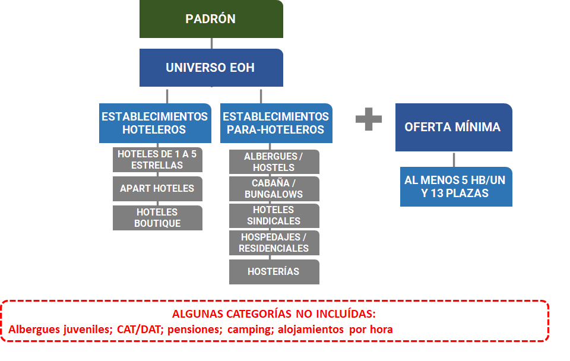

```{r setup, include=FALSE}
options(htmltools.dir.version = FALSE)
library(fontawesome)
library(rvest)
library(httr)
# library(emo)
```

```{r xaringan-themer, include=FALSE, warning=FALSE}
library(xaringanthemer)
style_mono_accent(
  base_color = "#756bb1")

  
```

```{r include=FALSE}
knitr::opts_chunk$set(echo = F, message = F, warning = F, 
                      fig.align = 'left')
options(scipen = 9999)

```

```{r}

library(readxl)
library(tidyverse)
library(magrittr)
library(writexl)
library(dplyr)
library(haven)
library(lubridate)
library(glue)
library(janitor)
library (gt)
library(sf)
library(ggrepel)

```

---

class: inverse, center, middle

# Encuesta de Viajes y Turismo en los Hogares (EVyTH)

---

class: justify, middle


## *Consideraciones generales del relevamiento* ##


- **Objetivo**: Medir y caracterizar la evolución de los viajes turísticos y los gastos asociados que las personas residentes en Argentina realizan tanto dentro del país (turismo interno) como al exterior (turismo emisivo). En conjunto, los viajes turísticos relevados dan cuenta del turismo nacional.


- **Temporalidad**: Encuesta de carácter mensual (Año 2006, 1er. Trim 2011 y  año 2012 de forma continua).


- **Representatividad geográfica**: Grandes Aglomerados Urbanos (más de 100 mil habitantes), el 62% de la población del país.


- **Método de recolección**: Encuestas telefónicas (CATI),

---

class: justify, top


## *Cobertura temática* ##


.pull-left[

**Caracterización del viaje**:

- Estadía del viaje
- Origen
- Destino principal del viaje
- Motivo de viaje
- Transporte
- Alojamiento
- Actividades realizadas
- Organización del viaje
- Calificación de diferentes aspectos
- Gasto
]

.pull-right[

**Caracterización de los visitantes**: 

- Sexo
- Edad
- Quintil de ingreso
- Tamaño del grupo familiar
- Educación
- Características ocupacionales
]

---

class: inverse, center, middle

# ¿Qué información se genera a partir del relevamiento?

---

## *Información disponible en el sitio web de SINTA* 

https://www.yvera.tur.ar/sinta/

.pull-left[


]
.pull-right[


]

---

.left[EVYTH: análisis de la información disponible]

```{r fig.height = 8, fig.width=15}


evyth <- read.csv("entradas/evyth/tur_int_turistas_residentes_destino_serie.csv",encoding = "UTF-8") %>% 
  mutate(anio = str_sub(indice_tiempo,1,4),
         mes = str_sub(indice_tiempo,6,7),
         anio_mes =glue("{anio}-{mes}-01"),
         anio_mes=as.Date(anio_mes))

evyth <- evyth %>%
  filter(anio %in% c("2018","2019","2020","2021","2022")) %>% 
  group_by(anio_mes) %>% 
  summarise(turistas=sum(turistas,na.rm=TRUE)) %>% 
  mutate(turistas=round(turistas/1000000,1)) %>% 
  mutate(anio_mes=as.character(anio_mes))

#Gráfico

ggplot(data = evyth,aes(x=anio_mes,y=turistas,label=turistas))+
  geom_col(size=2.5, alpha = 0.7,color="orange")+
  geom_text(size=5, position = position_dodge(width = 1),
            vjust = -0.5)+
  geom_hline(yintercept = 0, color = "grey", alpha =0.7, size = 0.5)+
  labs(title = "Evolución del total de turistas por trimestre",
       subtitle = "TOTAL PAIS, AÑOS 2018-2022.",
       x = "",
       y = "turistas (millones)",
       colour="",
       caption = "Fuente: EVyTH") +
  theme(text = element_text(size = 14),
        plot.caption  = element_text(hjust = 0),
        plot.subtitle=element_text(colour = "grey29"),
        plot.title=element_text(hjust = 0,face = "bold"),
        legend.title = element_blank(),
        legend.position = "bottom",
        panel.grid.major.y =  element_line (colour = "grey",
                                            size = 0.1,
                                            linewidth = 1),
        panel.grid.major.x =  element_blank(),
        panel.background = element_blank(),
        axis.text.x = element_text(angle = 90),
        axis.text.y = element_blank(),
        axis.ticks.y = element_blank())+
  scale_y_continuous(n.breaks=10)


rm(evyth)

```

---

.left[EVYTH: Análisis de la información disponible]


```{r fig.height = 8, fig.width=12, fig.align='center'}

evyth <- read.csv("entradas/evyth/tur_int_turistas_residentes_destino_serie.csv") %>% 
  mutate(anio = str_sub(indice_tiempo,1,4),
         mes = str_sub(indice_tiempo,6,7),
         anio_mes =glue("{anio}-{mes}-01"),
         anio_mes=as.Date(anio_mes))

evyth <- evyth %>%group_by(anio,region_destino) %>% 
  summarise(turistas=sum(turistas)) %>% 
  mutate(dist=prop.table(turistas)) %>% 
  mutate(dist=round(dist*100,1))

#Gráfico

ggplot(data = evyth,aes(x=anio,y=dist,fill=region_destino,label=glue("{dist} %")))+
  geom_col()+
  geom_text(position = position_stack(vjust = .5))+
  scale_y_continuous(labels = function(x) paste0(x,"%"))+
  labs(title = "Distribución de los turistas segun región de destino",
       subtitle = "GAU, 2012-2022.",
       x = "",
       y = "",
       colour="",
       caption = "Fuente: EVyTH") +
  theme(text = element_text(size = 12),
        plot.caption  = element_text(hjust = 0),
        plot.subtitle=element_text(colour = "grey29"),
        plot.title=element_text(hjust = 0,face = "bold"),
        legend.title = element_blank(),
        legend.position = "top",
        panel.background = element_blank(),
        panel.grid.major = element_blank(),
        panel.grid.minor = element_blank())


rm(evyth)

```

---

.left[EVYTH: Análisis de la información disponible]


```{r fig.height = 8, fig.width=12, fig.align='center'}

evyth <- read.csv("entradas/evyth/tur_int_turistas_residentes_origen_serie.csv") %>% 
  mutate(anio = str_sub(indice_tiempo,1,4),
         mes = str_sub(indice_tiempo,6,7),
         anio_mes =glue("{anio}-{mes}-01"),
         anio_mes=as.Date(anio_mes)) 

evyth <- evyth %>% 
  group_by(anio,region_origen) %>% 
  summarise(turistas=sum(turistas,na.rm=TRUE)) %>% 
  mutate(dist=prop.table(turistas)) %>% 
  mutate(dist=(round(dist,3)*100))


# Distribución de turistas por destino según año

ggplot(data = evyth,aes(x=anio,y=dist,fill=region_origen,label=glue("{dist} %")))+
  geom_col()+
  geom_text(position = position_stack(vjust = .5))+
  scale_y_continuous(labels = function(x) paste0(x,"%"))+
  labs(title = "Distribución de los turistas segun región de origen",
       subtitle = "GAU, 2012-2022.",
       x = "",
       y = "",
       colour="",
       caption = "Fuente: EVyTH") +
  theme(text = element_text(size = 12),
        plot.caption  = element_text(hjust = 0),
        plot.subtitle=element_text(colour = "grey29"),
        plot.title=element_text(hjust = 0,face = "bold"),
        legend.title = element_blank(),
        legend.position = "top",
        panel.background = element_blank(),
        panel.grid.major = element_blank(),
        panel.grid.minor = element_blank())

rm(evyth)


```


---

.left[EVYTH: Análisis de la información disponible]


```{r fig.height = 8, fig.width=12, fig.align='center'}

#Turistas por origen:

#Edad

evyth <- read.csv("entradas/evyth/tur_int_turistas_residentes_edad_serie.csv") %>% 
  mutate(anio = str_sub(indice_tiempo,1,4),
         mes = str_sub(indice_tiempo,6,7),
         anio_mes =glue("{anio}-{mes}-01"),
         anio_mes=as.Date(anio_mes)) 

evyth <- evyth %>% 
  group_by(anio,edad) %>% 
  summarise(turistas=sum(turistas,na.rm=TRUE)) %>% 
  mutate(dist=prop.table(turistas)) %>% 
  mutate(dist=(round(dist,3)*100))


# Distribución de turistas por destino según año

ggplot(data = evyth,aes(x=anio,y=dist,fill=edad,label=glue("{dist} %")))+
  geom_col()+
  geom_text(position = position_stack(vjust = .5))+
  scale_y_continuous(labels = function(x) paste0(x,"%"))+
  labs(title = "Distribución de los turistas segun edad",
       subtitle = "GAU, 2012-2022.",
       x = "",
       y = "",
       colour="",
       caption = "Fuente: EVyTH") +
  theme(text = element_text(size = 12),
        plot.caption  = element_text(hjust = 0),
        plot.subtitle=element_text(colour = "grey29"),
        plot.title=element_text(hjust = 0,face = "bold"),
        legend.title = element_blank(),
        legend.position = "top",
        panel.background = element_blank(),
        panel.grid.major = element_blank(),
        panel.grid.minor = element_blank())

rm(evyth)


```


---

.left[EVYTH: Análisis de la información disponible]


```{r fig.height = 8, fig.width=12, fig.align='center'}

evyth <- read.csv("entradas/evyth/tur_int_turistas_residentes_sexo_serie.csv") %>% 
  mutate(anio = str_sub(indice_tiempo,1,4),
         mes = str_sub(indice_tiempo,6,7),
         anio_mes =glue("{anio}-{mes}-01"),
         anio_mes=as.Date(anio_mes)) 

evyth <- evyth %>% 
  group_by(anio,sexo) %>% 
  summarise(turistas=sum(turistas,na.rm=TRUE)) %>% 
  mutate(dist=prop.table(turistas)) %>% 
  mutate(dist=(round(dist,3)*100))


# Distribución de turistas por destino según año

ggplot(data = evyth,aes(x=anio,y=dist,fill=sexo,label=glue("{dist} %")))+
  geom_col()+
  geom_text(position = position_stack(vjust = .5))+
  scale_y_continuous(labels = function(x) paste0(x,"%"))+
  labs(title = "Distribución de los turistas segun sexo.",
       subtitle = "GAU, 2012-2022.",
       x = "",
       y = "",
       colour="",
       caption = "Fuente: EVyTH") +
  theme(text = element_text(size = 12),
        plot.caption  = element_text(hjust = 0),
        plot.subtitle=element_text(colour = "grey29"),
        plot.title=element_text(hjust = 0,face = "bold"),
        legend.title = element_blank(),
        legend.position = "top",
        panel.background = element_blank(),
        panel.grid.major = element_blank(),
        panel.grid.minor = element_blank())

rm(evyth)

```


---

.left[EVYTH: Análisis de la información disponible]

```{r fig.height = 8, fig.width=12, fig.align='center'}

evyth <- read.csv("entradas/evyth/tur_int_turistas_residentes_quintil_serie.csv") %>% 
  mutate(anio = str_sub(indice_tiempo,1,4),
         mes = str_sub(indice_tiempo,6,7),
         anio_mes =glue("{anio}-{mes}-01"),
         anio_mes=as.Date(anio_mes)) 

evyth <- evyth %>% 
  group_by(anio,quintil) %>% 
  summarise(turistas=sum(turistas,na.rm=TRUE)) %>% 
  mutate(dist=prop.table(turistas)) %>% 
  mutate(dist=(round(dist,3)*100))


#Gráfico

ggplot(data = evyth %>% mutate(quintil=factor(quintil,levels = c("Quintiles 1 y 2",
                                                                  "Quintiles 3 y 4",
                                                                  "Quintil 5"))) ,aes(x=anio,y=dist,fill=quintil,label=glue("{dist} %")))+
  geom_col()+
  geom_text(position = position_stack(vjust = .5))+
  scale_y_continuous(labels = function(x) paste0(x,"%"))+
  labs(title = "Distribución de los turistas segun quintil de ingresos.",
       subtitle = "GAU, 2012-2022.",
       x = "",
       y = "",
       colour="",
       caption = "Fuente: EVyTH") +
  theme(text = element_text(size = 12),
        plot.caption  = element_text(hjust = 0),
        plot.subtitle=element_text(colour = "grey29"),
        plot.title=element_text(hjust = 0,face = "bold"),
        legend.title = element_blank(),
        legend.position = "top",
        panel.background = element_blank(),
        panel.grid.major = element_blank(),
        panel.grid.minor = element_blank())

rm(evyth)


```


---


.left[EVYTH: Análisis de la información disponible]


```{r fig.height = 8, fig.width=12, fig.align='center'}


evyth <- read.csv("entradas/evyth/tur_int_turistas_residentes_motivo_serie.csv") %>% 
  mutate(anio = str_sub(indice_tiempo,1,4),
         mes = str_sub(indice_tiempo,6,7),
         anio_mes =glue("{anio}-{mes}-01"),
         anio_mes=as.Date(anio_mes)) 

evyth <- evyth %>% 
  group_by(anio,motivo) %>% 
  summarise(turistas=sum(turistas,na.rm=TRUE)) %>% 
  mutate(dist=prop.table(turistas)) %>% 
  mutate(dist=(round(dist,3)*100))


#Gráfico

ggplot(data = evyth,aes(x=anio,y=dist,fill=motivo,label=glue("{dist} %")))+
  geom_col()+
  geom_text(position = position_stack(vjust = .5))+
  scale_y_continuous(labels = function(x) paste0(x,"%"))+
  labs(title = "Distribución de los turistas segun principal motivo de viaje.",
       subtitle = "GAU, 2012-2022.",
       x = "",
       y = "",
       colour="",
       caption = "Fuente: EVyTH") +
  theme(text = element_text(size = 12),
        plot.caption  = element_text(hjust = 0),
        plot.subtitle=element_text(colour = "grey29"),
        plot.title=element_text(hjust = 0,face = "bold"),
        legend.title = element_blank(),
        legend.position = "top",
        panel.background = element_blank(),
        panel.grid.major = element_blank(),
        panel.grid.minor = element_blank())

rm(evyth)


```


---

.left[EVYTH: Análisis de la información disponible]

```{r fig.height = 8, fig.width=12, fig.align='center'}


evyth <- read.csv("entradas/evyth/tur_int_turistas_residentes_tipo_alojamiento_serie.csv") %>% 
  mutate(anio = str_sub(indice_tiempo,1,4),
         mes = str_sub(indice_tiempo,6,7),
         anio_mes =glue("{anio}-{mes}-01"),
         anio_mes=as.Date(anio_mes)) 

evyth <- evyth %>% 
  group_by(anio,tipo_alojamiento) %>% 
  summarise(turistas=sum(turistas,na.rm=TRUE)) %>% 
  mutate(dist=prop.table(turistas)) %>% 
  mutate(dist=(round(dist,3)*100))


#Gráfico (cambiar colores)

ggplot(data = evyth,aes(x=anio,y=dist,fill=tipo_alojamiento,label=glue("{dist} %")))+
  geom_col()+
  geom_text(position = position_stack(vjust = .5))+
  scale_y_continuous(labels = function(x) paste0(x,"%"))+
  labs(title = "Distribución de los turistas segun tipo de alojamiento.",
       subtitle = "GAU, 2012-2022.",
       x = "",
       y = "",
       colour="",
       caption = "Fuente: EVyTH") +
  theme(text = element_text(size = 12),
        plot.caption  = element_text(hjust = 0),
        plot.subtitle=element_text(colour = "grey29"),
        plot.title=element_text(hjust = 0,face = "bold"),
        legend.title = element_blank(),
        legend.position = "top",
        panel.background = element_blank(),
        panel.grid.major = element_blank(),
        panel.grid.minor = element_blank())

rm(evyth)


```


---

.left[EVYTH: Análisis de la información disponible]


```{r fig.height = 8, fig.width=12, fig.align='center'}


evyth <- read.csv("entradas/evyth/tur_int_turistas_residentes_tipo_transporte_serie.csv") %>% 
  mutate(anio = str_sub(indice_tiempo,1,4),
         mes = str_sub(indice_tiempo,6,7),
         anio_mes =glue("{anio}-{mes}-01"),
         anio_mes=as.Date(anio_mes)) 

evyth <- evyth %>% 
  group_by(anio,tipo_transporte) %>% 
  summarise(turistas=sum(turistas,na.rm=TRUE)) %>% 
  mutate(dist=prop.table(turistas)) %>% 
  mutate(dist=(round(dist,3)*100))


#Gráfico

ggplot(data = evyth,aes(x=anio,y=dist,fill=tipo_transporte,label=glue("{dist} %")))+
  geom_col()+
  geom_text(position = position_stack(vjust = .5))+
  scale_y_continuous(labels = function(x) paste0(x,"%"))+
  labs(title = "Distribución de los turistas segun tipo de transporte utilizado.",
       subtitle = "GAU, 2012-2022.",
       x = "",
       y = "",
       colour="",
       caption = "Fuente: EVyTH") +
  theme(text = element_text(size = 12),
        plot.caption  = element_text(hjust = 0),
        plot.subtitle=element_text(colour = "grey29"),
        plot.title=element_text(hjust = 0,face = "bold"),
        legend.title = element_blank(),
        legend.position = "top",
        panel.background = element_blank(),
        panel.grid.major = element_blank(),
        panel.grid.minor = element_blank())

rm(evyth)


```


---

.left[EVYTH: Análisis de la información disponible]

```{r fig.height = 8, fig.width=12, fig.align='center'}

em <- read.csv("entradas/evyth/tur_int_turistas_residentes_estadia_media_anual_destino_serie.csv") %>% 
  mutate(anio=as.numeric(indice_tiempo)) %>% 
  filter(anio>2018) %>% 
  arrange(anio,estadia_promedio_anual)

orden <- em %>% 
  filter(anio==2019) %>% 
  select(region_destino)

orden <- (orden$region_destino)

#Gráfico:

ggplot(data = em %>% mutate(region_destino=factor(region_destino,levels = orden)),aes(x=estadia_promedio_anual, y=region_destino,
                     fill=region_destino,label=estadia_promedio_anual))+ 
  geom_col(color="grey")+
  geom_text(position = position_dodge(width = 1),
            hjust = -0.5)+
  facet_wrap(~anio)+
  labs(title = "Estadía promedio según región de destino.",
       subtitle = "GAU, 2019-2022.",
       x = "",
       y = "",
       colour="",
       caption = "Fuente: EVyTH") +
  theme(text = element_text(size = 12),
        plot.caption  = element_text(hjust = 0),
        plot.subtitle=element_text(colour = "grey29"),
        plot.title=element_text(hjust = 0,face = "bold"),
        legend.title = element_blank(),
        legend.position = "",
        panel.background = element_blank(),
        panel.grid.major = element_blank(),
        panel.grid.minor = element_blank(),
        axis.text.x = element_blank(),
        axis.ticks.x = element_blank())

rm(em,orden)
```


---

.left[EVYTH: Análisis de la información disponible]

```{r fig.height = 8, fig.width=12, fig.align='center'}

#GPD


gpd <- read.csv("entradas/evyth/tur_int_turistas_residentes_gasto_promedio_anual_destino_serie.csv",encoding = "UTF-8") %>% 
  mutate(anio=as.character(indice_tiempo)) %>% 
  mutate(gasto_promedio_anual=round(gasto_promedio_anual/1000,1))

#Gráfico:

ggplot(data = gpd,aes(x=anio, y=gasto_promedio_anual,fill=region_destino,label=gasto_promedio_anual))+ 
  geom_col(color="grey")+
  geom_text(position = position_dodge(width = 1),
            vjust = -0.5)+
  facet_wrap(~region_destino)+
  labs(title = "Gasto promedio (en miles) según región de destino.",
       subtitle = "GAU, 2019-2022.",
       x = "",
       y = "",
       colour="",
       caption = "Fuente: EVyTH") +
  theme(text = element_text(size = 14),
        plot.caption  = element_text(hjust = 0),
        plot.subtitle=element_text(colour = "grey29"),
        plot.title=element_text(hjust = 0,face = "bold"),
        legend.title = element_blank(),
        legend.position = "",
        panel.background = element_blank(),
        panel.grid.major = element_blank(),
        panel.grid.minor = element_blank())+
  scale_y_continuous(n.breaks=6,limits = c(0,60))

rm(gpd)


```

---

.left[EVYTH: Análisis de la información disponible]


```{r fig.height = 8, fig.width=12, fig.align='center'}

evyth <- read.csv("entradas/evyth/comptur_poblacion_viajera_anual_serie.csv",
                encoding = "UTF-8") %>% 
  filter(indice_tiempo>=2012) %>% 
  mutate(dist=round(participacion*100,1),
         anio=as.character(indice_tiempo))

#Gráfico:

ggplot(data = evyth,aes(x=anio,y=dist,label=glue("{dist} %")))+
  geom_col(size=2.5, alpha = 0.7,color="violet")+
  geom_text(size=5, position = position_dodge(width = 1),
            vjust = -0.5)+
  geom_hline(yintercept = 0, color = "grey", alpha =0.7, size = 0.5)+
  labs(title = "Proporción de la población que realizó al menos un viaje en el año",
       subtitle = "TOTAL PAIS, AÑOS 2012-2021.",
       x = "",
       y = "",
       colour="",
       caption = "Fuente: EVyTH") +
  theme(text = element_text(size = 14),
        plot.caption  = element_text(hjust = 0),
        plot.subtitle=element_text(colour = "grey29"),
        plot.title=element_text(hjust = 0,face = "bold"),
        legend.title = element_blank(),
        legend.position = "bottom",
        panel.grid.major.y =  element_line (colour = "grey",
                                            size = 0.1,
                                            linewidth = 1),
        panel.grid.major.x =  element_blank(),
        panel.background = element_blank(),
        axis.text.x = element_text(angle = 90),
        axis.text.y = element_blank(),
        axis.ticks.y = element_blank())+
  scale_y_continuous(n.breaks=10)


```


---

class: inverse, center, middle

# Encuesta de Ocupación Hotelera (EOH)

---

class: justify, middle


## *Consideraciones generales del relevamiento* ##

- **Objetivo**: Medir el impacto del turismo internacional e interno sobre la actividad de los establecimientos hoteleros y para-hoteleros del país (relevando información relacionada tanto con la OFERTA como con la DEMANDA)


- **Periodicidad**: Mensual, desde 2004.


- **Representatividad geográfica**: Se relevan 49 localidades, cuyos resultados se expanden a la totalidad de las regiones MINTURDEP


- **Método de recolección**: Cuestionario Auto-administrado.


- **Periodicidad de publicación de los datos**: 50 días posteriores al período relevado.

---

.left[#CATEGORÍAS RELEVADAS]


```{r out.width = "900px", out.height="500px",fig.align='center'}

```

---

background-image: url(pics/localidades_eoh.png)

---

## *Cobertura temática*


- Cantidad de HABITACIONES, UNIDADES Y PLAZAS disponibles por mes
- Cantidad de HABITACIONES, UNIDADES Y PLAZAS ocupadas por mes
- Cantidad de HABITACIONES, UNIDADES Y PLAZAS ocupadas en fines de semana (vie-sab)
- Viajeros y pernoctes registrados según origen
- Cantidad de días de apertura
- Personal ocupado
- Tarifa promedio
- Estructura por rubro de ingresos


---

class: inverse, center, middle

# ANÁLISIS DE LA INFORMACIÓN DISPONIBLE

---

.left[EOH: análisis de la información disponible]


```{r fig.height = 8, fig.width=12, fig.align='center'}

#Gráfico


eoh <- read.csv("entradas/eoh/Viajeros-hospedados-residentes-y-no-residentes.csv") %>% 
  mutate(anio = str_sub(indice_tiempo,1,4),
         mes = str_sub(indice_tiempo,6,7),
         anio_mes =glue("{anio}-{mes}-01"),
         anio_mes=as.Date(anio_mes)) %>% 
  select(-observaciones)


ggplot(data = eoh %>%
         filter(anio %in% c("2019","2020","2021","2022")) %>% 
         mutate(viajeros=viajeros/1000),aes(x=anio_mes,y=viajeros,color=origen_viajeros))+
  geom_line(size=2.5, alpha = 0.5)+
  geom_point(size=5, alpha = 0.5)+
  geom_hline(yintercept = 0, color = "grey", alpha =0.7, size = 0.5)+
  labs(title = "Viajeros hospedados según residencia",
       subtitle = "Total país, 2019-2022.",
       x = "",
       y = "Turistas (en miles)",
       colour="",
       caption = "Fuente: EOH") +
  theme(text = element_text(size = 14),
        plot.caption  = element_text(hjust = 0),
        plot.subtitle=element_text(colour = "grey29"),
        plot.title=element_text(hjust = 0,face = "bold"),
        legend.title = element_blank(),
        legend.position = "bottom",
        panel.grid.major.y =  element_line (colour = "grey",
                                            size = 0.1,
                                            linewidth = 1),
        panel.grid.major.x =  element_line (colour = "grey",
                                            size = 0.1,
                                            linewidth  = 1),
        panel.background = element_blank(),
        axis.text.x = element_text(angle = 90))+
  scale_x_date(date_breaks = "1 months",
               date_labels = "%b-%y")+
  scale_y_continuous(n.breaks=10)

rm(eoh)


```

---

.left[EOH: análisis de la información disponible]


```{r fig.height = 8, fig.width=12, fig.align='center'}

#Gráfico


eoh <- read.csv("entradas/eoh/Viajeros-hospedados-residentes-y-no-residentes-por-destino.csv") %>% 
  mutate(anio = str_sub(indice_tiempo,1,4),
         mes = str_sub(indice_tiempo,6,7),
         anio_mes =glue("{anio}-{mes}-01"),
         anio_mes=as.Date(anio_mes)) %>% 
  select(-observaciones)

eoh <- eoh %>% 
  filter(anio=="2019") %>% 
  group_by(anio,region_de_destino,origen_viajeros) %>% 
  summarise(viajeros=sum(viajeros)) %>%
  mutate(prop=(round(prop.table(viajeros),3))*100) %>% 
  ungroup %>% 
  select(-anio)

#Gráfico

ggplot(data = eoh,aes(x=region_de_destino,y=prop,fill=origen_viajeros,label=glue("{prop} %")))+
  geom_col()+
  geom_text(position = position_stack(vjust = .5))+
  scale_y_continuous(labels = function(x) paste0(x,"%"))+
  labs(title = "Distribución de los viajeros hospedados segun origen, por región de destino.",
       subtitle = "AÑO 2019.",
       x = "",
       y = "",
       colour="",
       caption = "Fuente: EOH") +
  theme(text = element_text(size = 12),
        plot.caption  = element_text(hjust = 0),
        plot.subtitle=element_text(colour = "grey29"),
        plot.title=element_text(hjust = 0,face = "bold"),
        legend.title = element_blank(),
        legend.position = "top",
        panel.background = element_blank(),
        panel.grid.major = element_blank(),
        panel.grid.minor = element_blank())

rm(eoh)

```


---

.left[EOH: análisis de la información disponible]


```{r fig.height = 8, fig.width=12, fig.align='center'}

#Gráfico


eoh <- read.csv("entradas/eoh/Pernoctes-residentes-y-no-residentes.csv") %>% 
  mutate(anio = str_sub(indice_tiempo,1,4),
         mes = str_sub(indice_tiempo,6,7),
         anio_mes =glue("{anio}-{mes}-01"),
         anio_mes=as.Date(anio_mes)) %>% 
  select(-observaciones)


ggplot(data = eoh %>%
         filter(anio %in% c("2019","2020","2021","2022")) %>% 
         mutate(pernoctes=pernoctes/1000),aes(x=anio_mes,y=pernoctes,color=origen_pernoctes))+
  geom_line(size=2.5, alpha = 0.5)+
  geom_point(size=5, alpha = 0.5)+
  geom_hline(yintercept = 0, color = "grey", alpha =0.7, size = 0.5)+
  labs(title = "Pernoctes según residencia",
       subtitle = "Total país, 2019-2022.",
       x = "",
       y = "Pernoctes (en miles)",
       colour="",
       caption = "Fuente: EOH") +
  theme(text = element_text(size = 14),
        plot.caption  = element_text(hjust = 0),
        plot.subtitle=element_text(colour = "grey29"),
        plot.title=element_text(hjust = 0,face = "bold"),
        legend.title = element_blank(),
        legend.position = "bottom",
        panel.grid.major.y =  element_line (colour = "grey",
                                            size = 0.1,
                                            linewidth = 1),
        panel.grid.major.x =  element_line (colour = "grey",
                                            size = 0.1,
                                            linewidth  = 1),
        panel.background = element_blank(),
        axis.text.x = element_text(angle = 90))+
  scale_x_date(date_breaks = "1 months",
               date_labels = "%b-%y")+
  scale_y_continuous(n.breaks=10)

rm(eoh)

```

---

.left[EOH: análisis de la información disponible]


```{r fig.height = 8, fig.width=12, fig.align='center'}

#Gráfico

eoh <- read.csv("entradas/eoh/Pernoctes-residentes-y-no-residentes-por-destino.csv") %>% 
  mutate(anio = str_sub(indice_tiempo,1,4),
         mes = str_sub(indice_tiempo,6,7),
         anio_mes =glue("{anio}-{mes}-01"),
         anio_mes=as.Date(anio_mes)) %>% 
  select(-observaciones)

eoh <- eoh %>% 
  filter(anio %in% c("2019","2020","2021") & region_de_destino=="CABA") %>% 
  group_by(anio_mes,region_de_destino,origen_pernoctes) %>% 
  summarise(pernoctes=round(sum(pernoctes)/1000,1))

ggplot(data = eoh,aes(x=anio_mes,y=pernoctes,color=origen_pernoctes))+
  geom_line(size=2.5, alpha = 0.5)+
  geom_point(size=5, alpha = 0.5)+
  geom_hline(yintercept = 0, color = "grey", alpha =0.7, size = 0.5)+
  labs(title = "Pernoctes según residencia",
       subtitle = "CABA, 2019-2021.",
       x = "",
       y = "Pernoctaciones (en miles)",
       colour="",
       caption = "Fuente: EOH") +
  theme(text = element_text(size = 14),
        plot.caption  = element_text(hjust = 0),
        plot.subtitle=element_text(colour = "grey29"),
        plot.title=element_text(hjust = 0,face = "bold"),
        legend.title = element_blank(),
        legend.position = "bottom",
        panel.grid.major.y =  element_line (colour = "grey",
                                            size = 0.1,
                                            linewidth = 1),
        panel.grid.major.x =  element_line (colour = "grey",
                                            size = 0.1,
                                            linewidth  = 1),
        panel.background = element_blank(),
        axis.text.x = element_text(angle = 90))+
  scale_x_date(date_breaks = "1 months",
               date_labels = "%b-%y")+
  scale_y_continuous(n.breaks=10)


rm(eoh)

```

---

.left[EOH: análisis de la información disponible]


```{r fig.height = 8, fig.width=12, fig.align='center'}


eoh <- read.csv("entradas/eoh/Pernoctes-residentes-y-no-residentes-por-destino.csv") %>% 
  mutate(anio = str_sub(indice_tiempo,1,4),
         mes = str_sub(indice_tiempo,6,7),
         anio_mes =glue("{anio}-{mes}-01"),
         anio_mes=as.Date(anio_mes)) %>% 
  select(-observaciones)

eoh <- eoh %>% 
  filter(anio %in% c("2019","2020","2021")) %>% 
  group_by(anio,region_de_destino) %>% 
  summarise(pernoctes=sum(pernoctes,na.rm=TRUE)) %>%
  mutate(prop=(round(prop.table(pernoctes),3))*100) %>% 
  ungroup() %>%
  select(-pernoctes)

#Gráfico

ggplot(data = eoh,aes(x=anio,y=prop,fill=region_de_destino,label=glue("{prop} %")))+
  geom_col()+
  geom_text(position = position_stack(vjust = .5))+
  scale_y_continuous(labels = function(x) paste0(x,"%"))+
  labs(title = "Distribución de los pernoctes según región de destino.",
       subtitle = "AÑOS 2019-2021.",
       x = "",
       y = "",
       colour="",
       caption = "Fuente: EOH") +
  theme(text = element_text(size = 12),
        plot.caption  = element_text(hjust = 0),
        plot.subtitle=element_text(colour = "grey29"),
        plot.title=element_text(hjust = 0,face = "bold"),
        legend.title = element_blank(),
        legend.position = "top",
        panel.background = element_blank(),
        panel.grid.major = element_blank(),
        panel.grid.minor = element_blank())


```


---
.left[EOH: análisis de la información disponible]


```{r fig.height = 8, fig.width=12, fig.align='center'}


eoh <- read.csv("entradas/eoh/estadia-media-residentes-y-no-residentes-por-destino.csv") %>% 
  mutate(anio = str_sub(indice_tiempo,1,4),
         mes = str_sub(indice_tiempo,6,7),
         anio_mes =glue("{anio}-{mes}-01"),
         anio_mes=as.Date(anio_mes)) %>% 
  select(-observaciones)

eoh <- eoh %>% 
  filter(anio %in% c("2019") & origen_viajeros=="Total") 
  

#Gráfico


ggplot(data = eoh,aes(x=anio_mes,y=estadia_media_en_noches,color=region_de_destino))+
  geom_point(size=5, alpha = 0.5,shape=17)+
  geom_hline(yintercept = 0, color = "grey", alpha =0.7, size = 0.5)+
  labs(title = "Estadía promedio en noches según región de destino",
       subtitle = "AÑO 2019.",
       x = "",
       y = "(noches)",
       colour="",
       caption = "Fuente: EOH") +
  theme(text = element_text(size = 14),
        plot.caption  = element_text(hjust = 0),
        plot.subtitle=element_text(colour = "grey29"),
        plot.title=element_text(hjust = 0,face = "bold"),
        legend.title = element_blank(),
        legend.position = "bottom",
        panel.grid.major.y =  element_line (colour = "grey",
                                            size = 0.1,
                                            linewidth = 1),
        panel.grid.major.x =  element_line (colour = "grey",
                                            size = 0.1,
                                            linewidth  = 1),
        panel.background = element_blank(),
        axis.text.x = element_text(angle = 90))+
  scale_x_date(date_breaks = "1 months",
               date_labels = "%b-%y")+
  scale_y_continuous(n.breaks=10)

rm(eoh)


```


---

.left[EOH: análisis de la información disponible]

```{r fig.height = 8, fig.width=12, fig.align='center'}


eoh <- read.csv("entradas/eoh/tasas-de-ocupación-plazas-por-categoría.csv") %>% 
  mutate(anio = str_sub(indice_tiempo,1,4),
         mes = str_sub(indice_tiempo,6,7),
         anio_mes =glue("{anio}-{mes}-01"),
         anio_mes=as.Date(anio_mes)) %>% 
  select(-observaciones)

eoh <- eoh %>% 
  filter(anio %in% c("2019"))

#Gráfico


ggplot(data = eoh,aes(x=anio_mes,y=tasa_de_ocupacion_plazas,color=categoria_del_hotel))+
  geom_line(size=2.5, alpha = 0.5)+
  geom_point(size=5, alpha = 0.5)+
  geom_hline(yintercept = 0, color = "grey", alpha =0.7, size = 0.5)+
  labs(title = "Tasa de ocupación en plazas según categoría",
       subtitle = "Total país, AÑO 2019.",
       x = "",
       y = "Tasa de ocupación en plazas",
       colour="",
       caption = "Fuente: EOH") +
  theme(text = element_text(size = 14),
        plot.caption  = element_text(hjust = 0),
        plot.subtitle=element_text(colour = "grey29"),
        plot.title=element_text(hjust = 0,face = "bold"),
        legend.title = element_blank(),
        legend.position = "bottom",
        panel.grid.major.y =  element_line (colour = "grey",
                                            size = 0.1,
                                            linewidth = 1),
        panel.grid.major.x =  element_line (colour = "grey",
                                            size = 0.1,
                                            linewidth  = 1),
        panel.background = element_blank(),
        axis.text.x = element_text(angle = 90))+
  scale_x_date(date_breaks = "1 months",
               date_labels = "%b-%y")+
  scale_y_continuous(n.breaks=10)

rm(eoh)


```


---

.left[EOH: análisis de la información disponible]

```{r fig.height = 8, fig.width=12, fig.align='center'}


eoh <- read.csv("entradas/eoh/tasas-de-ocupación-plazas-por-región-y-categoría.csv") %>% 
  mutate(anio = str_sub(indice_tiempo,1,4),
         mes = str_sub(indice_tiempo,6,7),
         anio_mes =glue("{anio}-{mes}-01"),
         anio_mes=as.Date(anio_mes)) %>% 
  select(-observaciones)

eoh <- eoh %>% 
  filter(anio %in% c("2019") & categoria_del_hotel=="Total") 
  

#Gráfico


ggplot(data = eoh,aes(x=anio_mes,y=tasa_de_ocupacion_plazas,color=region_de_destino))+
  geom_line(size=2.5, alpha = 0.5)+
  geom_point(size=5, alpha = 0.5)+
  geom_hline(yintercept = 0, color = "grey", alpha =0.7, size = 0.5)+
  labs(title = "Tasa de ocupación en plazas según región de destino",
       subtitle = "AÑO 2019.",
       x = "",
       y = "Tasa de ocupación en plazas",
       colour="",
       caption = "Fuente: EOH") +
  theme(text = element_text(size = 14),
        plot.caption  = element_text(hjust = 0),
        plot.subtitle=element_text(colour = "grey29"),
        plot.title=element_text(hjust = 0,face = "bold"),
        legend.title = element_blank(),
        legend.position = "bottom",
        panel.grid.major.y =  element_line (colour = "grey",
                                            size = 0.1,
                                            linewidth = 1),
        panel.grid.major.x =  element_line (colour = "grey",
                                            size = 0.1,
                                            linewidth  = 1),
        panel.background = element_blank(),
        axis.text.x = element_text(angle = 90))+
  scale_x_date(date_breaks = "1 months",
               date_labels = "%b-%y")+
  scale_y_continuous(n.breaks=10)

rm(eoh)


```

---

.left[EOH: análisis de la información disponible]


```{r fig.height = 8, fig.width=12, fig.align='center'}


eoh <- read.csv("entradas/eoh/tarifa-media-diaria-por-categoría.csv") %>% 
  mutate(anio = str_sub(indice_tiempo,1,4),
         mes = str_sub(indice_tiempo,6,7),
         anio_mes =glue("{anio}-{mes}-01"),
         anio_mes=as.Date(anio_mes)) %>% 
  select(-observaciones)

eoh <- eoh %>% 
  filter(anio %in% c("2018","2019","2020","2021","2022")) 
  

#Gráfico


ggplot(data = eoh,aes(x=anio_mes,y=tarifa_media_diaria,color=categoria_del_hotel))+
  geom_line(size=2.5, alpha = 0.5)+
  geom_point(size=5, alpha = 0.5)+
  geom_hline(yintercept = 0, color = "grey", alpha =0.7, size = 0.5)+
  labs(title = "Tarifa media diaria según categoría.",
       subtitle = "Total país, AÑOS 2018-2022.",
       x = "",
       y = "En pesos a precios corrientes.",
       colour="",
       caption = "Fuente: EOH") +
  theme(text = element_text(size = 14),
        plot.caption  = element_text(hjust = 0),
        plot.subtitle=element_text(colour = "grey29"),
        plot.title=element_text(hjust = 0,face = "bold"),
        legend.title = element_blank(),
        legend.position = "bottom",
        panel.grid.major.y =  element_line (colour = "grey",
                                            size = 0.1,
                                            linewidth = 1),
        panel.grid.major.x =  element_line (colour = "grey",
                                            size = 0.1,
                                            linewidth  = 1),
        panel.background = element_blank(),
        axis.text.x = element_text(angle = 90))+
  scale_x_date(date_breaks = "1 months",
               date_labels = "%b-%y")+
  scale_y_continuous(n.breaks=10)

rm(eoh)


```


---

.left[EOH: análisis de la información disponible]

```{r fig.height = 8, fig.width=12, fig.align='center'}


eoh <- read.csv("entradas/eoh/tarifa-media-diaria-por-región-y-categoría.csv") %>% 
  mutate(anio = str_sub(indice_tiempo,1,4),
         mes = str_sub(indice_tiempo,6,7),
         anio_mes =glue("{anio}-{mes}-01"),
         anio_mes=as.Date(anio_mes)) %>% 
  select(-observaciones)

eoh <- eoh %>% 
  filter(anio %in% c("2018","2019","2020","2021","2022") & categoria_del_hotel=="Total") 
  

#Gráfico


ggplot(data = eoh,aes(x=anio_mes,y=tarifa_media_diaria,color=region_de_destino))+
  geom_line(size=1.5, alpha = 0.5)+
  geom_point(size=3, alpha = 0.5)+
  geom_hline(yintercept = 0, color = "grey", alpha =0.7, size = 0.5)+
  labs(title = "Tarifa media diaria según región de destino.",
       subtitle = "Total país, AÑOS 2018-2022.",
       x = "",
       y = "En pesos a precios corrientes.",
       colour="",
       caption = "Fuente: EOH") +
  theme(text = element_text(size = 14),
        plot.caption  = element_text(hjust = 0),
        plot.subtitle=element_text(colour = "grey29"),
        plot.title=element_text(hjust = 0,face = "bold"),
        legend.title = element_blank(),
        legend.position = "bottom",
        panel.grid.major.y =  element_line (colour = "grey",
                                            size = 0.1,
                                            linewidth = 1),
        panel.grid.major.x =  element_line (colour = "grey",
                                            size = 0.1,
                                            linewidth  = 1),
        panel.background = element_blank(),
        axis.text.x = element_text(angle = 90))+
  scale_x_date(date_breaks = "1 months",
               date_labels = "%b-%y")+
  scale_y_continuous(n.breaks=10)

rm(eoh)


```


---
.left[EOH: análisis de la información disponible]


```{r fig.height = 8, fig.width=12, fig.align='center'}

eoh <- read.csv("entradas/eoh/puestos-de-trabajo-totales.csv") %>% 
  mutate(anio = str_sub(indice_tiempo,1,4),
         mes = str_sub(indice_tiempo,6,7),
         anio_mes =glue("{anio}-{mes}-01"),
         anio_mes=as.Date(anio_mes)) %>% 
  select(-observaciones) %>% 
  filter(anio %in% c("2019","2020","2021","2022")) 


#Gráfico

ggplot(data = eoh,aes(x=anio_mes,y=puestos_de_trabajo))+
  geom_line(size=2.5, alpha = 0.7,color="orange")+
  geom_point(size=5, alpha = 0.7,color="orange")+
  geom_hline(yintercept = 0, color = "grey", alpha =0.7, size = 0.5)+
  labs(title = "Puestos de trabajo en establecimientos hoteleros y parahoteleros.",
       subtitle = "TOTAL PAIS, AÑOS 2019-2022.",
       x = "",
       y = "Puestos de trabajo",
       colour="",
       caption = "Fuente: EOH") +
  theme(text = element_text(size = 14),
        plot.caption  = element_text(hjust = 0),
        plot.subtitle=element_text(colour = "grey29"),
        plot.title=element_text(hjust = 0,face = "bold"),
        legend.title = element_blank(),
        legend.position = "bottom",
        panel.grid.major.y =  element_line (colour = "grey",
                                            size = 0.1,
                                            linewidth = 1),
        panel.grid.major.x =  element_line (colour = "grey",
                                            size = 0.1,
                                            linewidth  = 1),
        panel.background = element_blank(),
        axis.text.x = element_text(angle = 90))+
  scale_x_date(date_breaks = "1 months",
               date_labels = "%b-%y")+
  scale_y_continuous(n.breaks=10)

rm(eoh)

```

---

.left[EOH: análisis de la información disponible]

```{r fig.height = 8, fig.width=12, fig.align='center'}


eoh <- read.csv("entradas/eoh/puestos-de-trabajo-totales-por-región-y-categoría.csv") %>% 
  mutate(anio = str_sub(indice_tiempo,1,4),
         mes = str_sub(indice_tiempo,6,7),
         anio_mes =glue("{anio}-{mes}-01"),
         anio_mes=as.Date(anio_mes)) %>% 
  select(-observaciones)

eoh <- eoh %>% 
  filter(anio %in% c("2018","2019","2022")) %>% 
  group_by(anio,region_de_destino) %>% 
  summarise(puestos_de_trabajo=sum(puestos_de_trabajo,na.rm=TRUE)) %>%
  mutate(prop=(round(prop.table(puestos_de_trabajo),3))*100)


#Gráfico

ggplot(data = eoh,aes(x=anio,y=prop,fill=region_de_destino,label=glue("{prop} %")))+
  geom_col()+
  geom_text(position = position_stack(vjust = .5))+
  scale_y_continuous(labels = function(x) paste0(x,"%"))+
  labs(title = "Distribución de los puestos de trabajo según región.",
       subtitle = "AÑOS 2018,2019,2022.",
       x = "",
       y = "",
       colour="",
       caption = "Fuente: EOH") +
  theme(text = element_text(size = 12),
        plot.caption  = element_text(hjust = 0),
        plot.subtitle=element_text(colour = "grey29"),
        plot.title=element_text(hjust = 0,face = "bold"),
        legend.title = element_blank(),
        legend.position = "top",
        panel.background = element_blank(),
        panel.grid.major = element_blank(),
        panel.grid.minor = element_blank())

rm(eoh)

```

---

.left[EOH: análisis de la información disponible]

```{r fig.height = 8, fig.width=12, fig.align='center'}

eoh <- read.csv("entradas/eoh/viajeros_por_localidad_segun_residencia.csv") %>% 
  mutate(anio = str_sub(indice_tiempo,1,4),
         mes = str_sub(indice_tiempo,6,7),
         anio_mes =glue("{anio}-{mes}-01"),
         anio_mes=as.Date(anio_mes)) %>% 
  select(-observaciones)

eoh <- eoh %>% 
  filter(anio %in% c("2019") & localidad %in% c("CABA","Villa Gesell","Mar del Plata")) %>% 
  group_by(anio_mes,localidad) %>% 
  summarise(viajeros=sum(viajeros,na.rm=TRUE))

#Gráfico

ggplot(data = eoh,aes(x=anio_mes,y=viajeros))+
  geom_line(size=1.5, alpha = 0.7,color="red")+
  geom_point(size=3, alpha = 0.7,color="red")+
  facet_wrap(~localidad)+
  geom_hline(yintercept = 0, color = "grey", alpha =0.7, size = 0.5)+
  labs(title = "Viajeros hospedados en establecimientos hoteleros y parahoteleros.",
       subtitle = "CABA, Mar del Plata y Villa Gesell; AÑO 2019.",
       x = "",
       y = "viajeros",
       colour="",
       caption = "Fuente: EOH") +
  theme(text = element_text(size = 14),
        plot.caption  = element_text(hjust = 0),
        plot.subtitle=element_text(colour = "grey29"),
        plot.title=element_text(hjust = 0,face = "bold"),
        legend.title = element_blank(),
        legend.position = "bottom",
        panel.grid.major.y =  element_line (colour = "grey",
                                            size = 0.1,
                                            linewidth = 1),
        panel.grid.major.x =  element_line (colour = "grey",
                                            size = 0.1,
                                            linewidth  = 1),
        panel.background = element_blank(),
        axis.text.x = element_text(angle = 90))+
  scale_x_date(date_breaks = "1 months",
               date_labels = "%b-%y")+
  scale_y_continuous(n.breaks=10)

rm(eoh)

```


---

class: inverse, center, middle

# Encuesta de Turismo Internacional (ETI)

---

class: justify, middle


## *Consideraciones generales:* 


- **Objetivo**: Caracterizar el FLUJO y medir el GASTO de los visitantes no residentes durante su permanencia en la Argentina (turismo receptivo) y el de los visitantes residentes en la Argentina durante su permanencia en el exterior (turismo emisivo).

- **Temporalidad**: Operativo mensual continuo (desde el año 2004).


- **Método de recolección**: Encuestas cara a cara (**al finalizar el viaje**).

- **Pasos relevados**:

1. Ezeiza y Aeroparque
1. Aeropuerto Internacional de Córdoba
1. Puerto de Buenos Aires
1. Aeropuerto Internacional de Mendoza
1. Paso internacional Cristo Redentor

---

class: justify, middle


## *Cobertura temática* 


* Residencia del viajero (país/región de origen) –ciudad y país-
* Tamaño del grupo de viaje
* Motivo del viaje
* Estadía
* Tipo de alojamiento utilizado
* Destinos visitados
* Tipo de organización del viaje
* Pernoctes por tipo de alojamiento
* Gasto durante la estadía (desagregada por rubro)
* Actividades realizadas en destino
* Evaluación del país (según rubro)
* Tiempo de anticipación del viaje
* Aspectos influyentes a la hora de viajar


---

class: inverse, center, middle

# ETI: Análisis de la información disponible

---

.left[ETI: análisis de la información disponible]

```{r fig.height = 8, fig.width=12, fig.align='center'}


eti <- read.csv("entradas/eti/turistas_pernoctes_estadia_media_turistas_no_residentes_por_residencia_ezeiza_aeroparque_mensual.csv") %>% 
  mutate(anio = str_sub(indice_tiempo,1,4),
         mes = str_sub(indice_tiempo,6,7),
         anio_mes =glue("{anio}-{mes}-01"),
         anio_mes=as.Date(anio_mes)) %>% 
  filter(anio_mes>="2018-01-01" & anio_mes<="2022-12-01")

eti <- eti %>% 
  group_by(anio_mes) %>%
  summarise(turistas=sum(turistas_no_residentes))


#Gráfico


ggplot(data = eti ,aes(x=anio_mes,y=turistas))+
  geom_line(size=1.5, alpha = 0.5,color="orange")+
  geom_point(size=3, alpha = 0.5,color="orange")+
  geom_hline(yintercept = 0, color = "grey", alpha =0.7, size = 0.5)+
  labs(title = "Evolución de los turistas no residentes",
       subtitle = "EZEIZA Y AEROPARQUE, 2018-2022.",
       x = "",
       y = "Turistas no residentes",
       colour="",
       caption = "Fuente: ETI") +
  theme(text = element_text(size = 14),
        plot.caption  = element_text(hjust = 0),
        plot.subtitle=element_text(colour = "grey29"),
        plot.title=element_text(hjust = 0,face = "bold"),
        legend.title = element_blank(),
        legend.position = "bottom",
        panel.grid.major.y =  element_line (colour = "grey",
                                            linewidth = 0.1),
        panel.grid.major.x =  element_line (colour = "grey",
                                            linewidth  = 0.1),
        panel.background = element_blank(),
        axis.text.x = element_text(angle = 90))+
  scale_x_date(date_breaks = "1 months",
               date_labels = "%b-%y")+
  scale_y_continuous(n.breaks=10)


rm(eti)

```


---


.left[ETI: análisis de la información disponible]

```{r fig.height = 8, fig.width=12, fig.align='center'}


eti <- read.csv("entradas/eti/turistas_pernoctes_estadia_media_turistas_no_residentes_por_residencia_ezeiza_aeroparque_mensual.csv") %>% 
  mutate(anio = str_sub(indice_tiempo,1,4),
         mes = str_sub(indice_tiempo,6,7),
         anio_mes =glue("{anio}-{mes}-01"),
         anio_mes=as.Date(anio_mes)) %>% 
  filter(anio_mes>="2017-01-01" & anio_mes<="2019-12-01")


#Gráfico


ggplot(data = eti ,aes(x=anio_mes,y=turistas_no_residentes,color=pais_de_residencia))+
  geom_line(size=1.5, alpha = 0.5)+
  geom_point(size=3, alpha = 0.5)+
  geom_hline(yintercept = 0, color = "grey", alpha =0.7, size = 0.5)+
  labs(title = "Turistas no residentes según país de residencia.",
       subtitle = "EZEIZA Y AEROPARQUE, 2017-2019.",
       x = "",
       y = "Turistas no residentes",
       colour="",
       caption = "Fuente: ETI") +
  theme(text = element_text(size = 14),
        plot.caption  = element_text(hjust = 0),
        plot.subtitle=element_text(colour = "grey29"),
        plot.title=element_text(hjust = 0,face = "bold"),
        legend.title = element_blank(),
        legend.position = "bottom",
        panel.grid.major.y =  element_line (colour = "grey",
                                            linewidth = 0.1),
        panel.grid.major.x =  element_line (colour = "grey",
                                            linewidth  = 0.1),
        panel.background = element_blank(),
        axis.text.x = element_text(angle = 90))+
  scale_x_date(date_breaks = "1 months",
               date_labels = "%b-%y")+
  scale_y_continuous(n.breaks=10)


rm(eti)

```

---

.left[ETI: análisis de la información disponible]


.pull-left[


]
.pull-right[


]

---

class: justify, middle


.left[ETI: análisis de la información disponible]


---


class: inverse, center, middle

# OTRAS FUENTES DE DATOS DISPONIBLES

---

##**¿Qué otros datos podemos encontrar?**:

- **Turismo Internacional**: Datos del volumen de turistas y excursionistas según país de residencia y medio de transporte.

- **Puna**: Padrón Único de Alojamientos

- **Conectividad aérea**: Caracterización de pasajeros y vuelos con origen o destino de la Argentina.

- **Informes de crucerismo en la Argentina**

- **Registro de agencia de viajes**

- **Visitas a parques nacionales**

- **Datos vinculados a previaje**

---

class: justify, middle

.left[Parques nacionales: análisis de la información disponible]

```{r fig.height = 8, fig.width=12, fig.align='center'}


parques <- read.csv("entradas/parques/visitas-residentes-y-no-residentes.csv", encoding = "UTF-8") %>% 
  mutate(anio = str_sub(indice_tiempo,1,4),
         mes = str_sub(indice_tiempo,6,7),
         anio_mes =glue("{anio}-{mes}-01"),
         anio_mes=as.Date(anio_mes),
         visitas=round(visitas/1000,1)) %>% 
  filter(anio %in% c("2019","2020","2021","2022")) 


#Gráfico

ggplot(data = parques,aes(x=anio_mes,y=visitas,color=origen_visitantes))+
  geom_line(size=2.5, alpha = 0.7)+
  geom_point(size=5, alpha = 0.7)+
  geom_hline(yintercept = 0, color = "grey", alpha =0.7, size = 0.5)+
  labs(title = "Visitas (en miles) a parques nacionales según residencia",
       subtitle = "TOTAL PAIS, AÑOS 2019-2022.",
       x = "",
       y = "Visitantes",
       colour="",
       caption = "FUENTE: Dirección Nacional de Mercados y Estadística, Ministerio de Turismo y Deportes,\nen base a datos suministrados por la Dirección de Mercadeo de la Dirección Nacional de Uso Público de la Administración de Parques Nacionales.") +
  theme(text = element_text(size = 14),
        plot.caption  = element_text(hjust = 0),
        plot.subtitle=element_text(colour = "grey29"),
        plot.title=element_text(hjust = 0,face = "bold"),
        legend.title = element_blank(),
        legend.position = "bottom",
        panel.grid.major.y =  element_line (colour = "grey",
                                            size = 0.1,
                                            linewidth = 1),
        panel.grid.major.x =  element_line (colour = "grey",
                                            size = 0.1,
                                            linewidth  = 1),
        panel.background = element_blank(),
        axis.text.x = element_text(angle = 90))+
  scale_x_date(date_breaks = "1 months",
               date_labels = "%b-%y")+
  scale_y_continuous(n.breaks=10)

rm(parques)

```


---


class: inverse, center, middle

# RESUMEN

---

##**RESUMEN**


---


class: inverse, center, middle

# MUCHAS GRACIAS!!!

