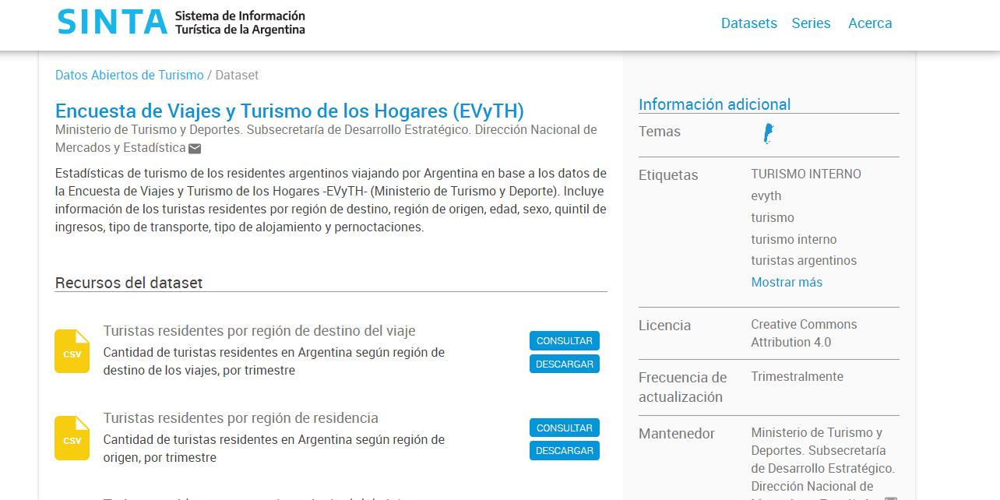

<script src="https://kit.fontawesome.com/cf918b5c60.js" crossorigin="anonymous"></script> 


```{r setup, include=FALSE}
options(htmltools.dir.version = FALSE)
library(fontawesome)
library(rvest)
library(httr)
# library(emo)
```

```{r xaringan-themer, include=FALSE, warning=FALSE}
library(xaringanthemer)
style_solarized_dark()
    
```

```{r include=FALSE}
knitr::opts_chunk$set(echo = F, message = F, warning = F, 
                      fig.align = 'left')
options(scipen = 9999)
```

```{r}

library(readxl)
library(tidyverse)
library(magrittr)
library(writexl)
library(dplyr)
library(haven)
library(lubridate)
library(glue)
library(janitor)

```


---

class: inverse, center, middle

# Encuesta de Viajes y Turismo en los Hogares (EVyTH)

---

class: justify, middle


## *Consideraciones generales del relevamiento* ##


- **Objetivo**: Medir y caracterizar la evolución de los viajes turísticos y los gastos asociados que las personas residentes en Argentina realizan tanto dentro del país (turismo interno) como al exterior (turismo emisivo). En conjunto, los viajes turísticos relevados dan cuenta del turismo nacional.


- **Temporalidad**: Encuesta de carácter mensual (Año 2006, 1er. Trim 2011 y  año 2012 de forma continua).


- **Representatividad geográfica**: Grandes Aglomerados Urbanos (más de 100 mil habitantes), el 62% de la población del país.


- **Método de recolección**: Encuestas telefónicas (CATI),

---

class: justify, top


## *Cobertura temática* ##


**Caracterización del viaje**:

- Estadía del viaje
- Origen
- Destino principal del viaje
- Motivo de viaje
- Transporte
- Alojamiento
- Actividades realizadas
- Organización del viaje
- Calificación de diferentes aspectos
- Gasto

---

class: justify, top

## *Cobertura temática* 


**Caracterización de los visitantes**: 

- Sexo
- Edad
- Quintil de ingreso
- Tamaño del grupo familiar
- Educación
- Características ocupacionales

---

class: inverse, center, middle

# ¿Qué información se genera a partir del relevamiento?

---

## *Información disponible en el sitio web de SINTA* 

https://www.yvera.tur.ar/sinta/



---


```{r}

turistas_dest_total <- read.csv("entradas/evyth/tur_int_turistas_residentes_destino_serie.csv") %>% 
  mutate(anio=year(indice_tiempo))

graf_1 <- turistas_dest_total %>%
  group_by(indice_tiempo) %>%
  summarise(turistas=sum(turistas)) %>% 
  ungroup() %>% 
  mutate(indice_tiempo=as.Date(indice_tiempo))


```


```{r fig.height = 8, fig.width=15}

#Turistas por trim:

ggplot(data = graf_1,aes(x=indice_tiempo,y=turistas))+
  geom_line(linewidth=2,color="red", alpha = 0.4)+
  geom_point(size=3,color="red", alpha = 0.9)+ 
  labs(title = "Turistas residentes segun trimestre",
       x = "",
       y = "Turistas",
       colour="",
       caption = "Fuente: EVyTH") +
  theme(text = element_text(size = 18, family = "Encode Sans Normal"),
        plot.caption  = element_text(hjust = 0),
        plot.subtitle=element_text(colour = "grey"),
        plot.title=element_text(hjust = 0,face = "bold"),
        legend.title = element_blank(),
        legend.position = "bottom",
        panel.grid.major.y =  element_line (colour = "grey",
                                            size = 0.1,
                                            linewidth = 1),
        panel.grid.major.x =  element_line (colour = "grey",
                                            size = 0.1,
                                            linewidth  = 1),
        panel.background = element_blank(),
        axis.text.x = element_text(angle = 90))


```


---

```{r width="50%"}


```


---

background-image: url(pics/sinta1.png)

background-size: cover


Para poner imagen de fondo


---

.left[HOLA!!!]

.right[HOLA!!!]

---

```{r out.width = "1000px", out.height="500px",fig.align='center'}

```


---
background-image: url("pics/sinta1.png")
background-position: 95% 0% 
background-size: 10%

---

xaringan::inf_mr()


